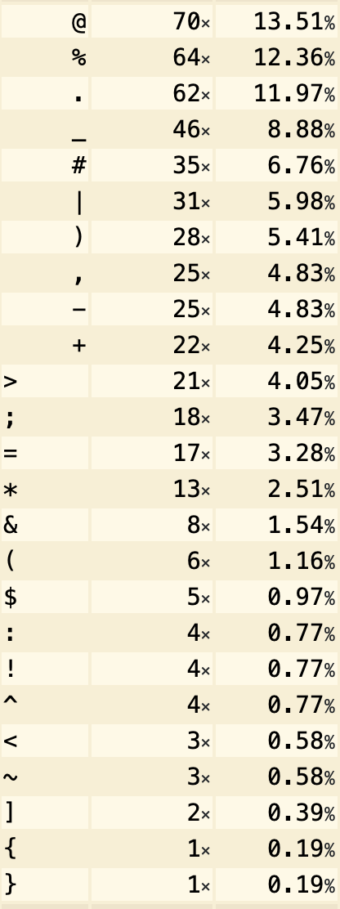
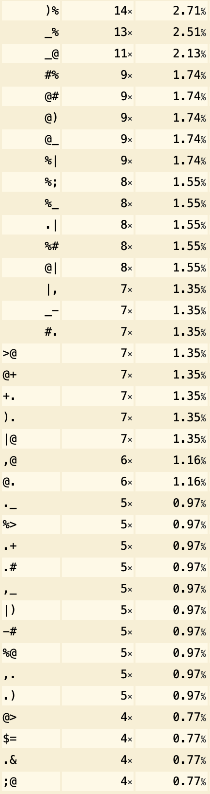
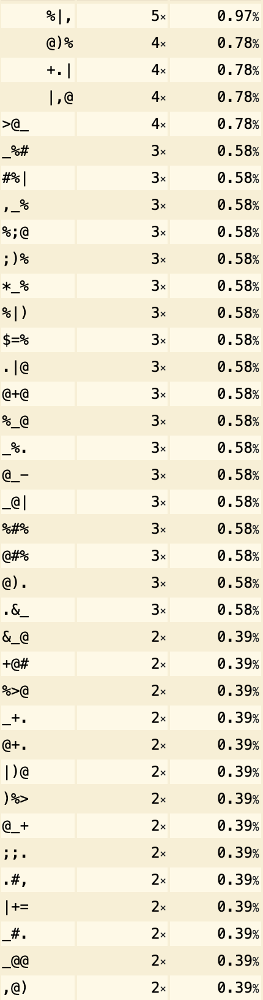
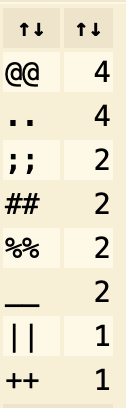

# CTF Semana #10 (Classical Encryption)

Tendo em conta que o texto original (plaintext) foi escrito **sem espaços** em `português` e que foi "cifrado com uma cifra clássica, que está a converter as letras habituais em símbolos misteriosos", podemos concluir que se trata de uma `cifra de substituição monoalfabética`. Com este tipo de cifra, mesmo convertendo uma letra do plaintext noutro símbolo, a sua `frequência` não irá ser alterada (assumindo que é sempre utilizado o mesmo símbolo para a mesma letra). Assim, é possível analisar a frequência de símbolos/letras (ou conjuntos de símbolos) no cyphertext.  
Esta análise da frequência é feita com base no facto de certas letras (e combinações) ocorrerem mais vezes que outras e assumindo que o cyphertext é suficientemente grande para seguir essa distribuição. Em português as letras mais frequentes são as vogais `A`, `E` e `O`, seguido das consoantes `S` e `R`. Ver tabela completa [aqui](https://pt.wikipedia.org/wiki/Alfabeto_português#Frequência_da_ocorrência_de_letras). Enquanto que as combinações são por exemplo `DE` e `QUE`. Contudo, tendo em conta que o plaintext não tem espaços, a análise destes bigramas e trigramas deverá ser feita com cuidado, porque podemos estar a considerar partes de duas palavras (por exemplo a última letra de uma palvavra e a primeira de outra).  
Para contar a frequência dos símbolos no cyphertext utilizou-se [este](https://www.dcode.fr/frequency-analysis) site, obtendo-se os seguintes resultados:

- Símbolos separados  



- Bigrams (tabela incompleta)  



- Trigrams (tabela incompleta)  



- Símbolos repetidos

  

Analisando a primeira tabela, verifica-se que os símbolos `@`, `%` e `.` se destacam, devendo estes eventualmente corresponder às vogais `A`, `E` e `O` respetivamente (o que foi o caso e facilitou muito o arranque inicial). Em seguida, em cada iteração (tentativa erro) tentamos inferir palavras. Por exemplo, sabendo que a letra `Q` não é frequente e assumindo que "%" correspondia a "E", tentou-se encontrar um padrão na tabela dos trigramas que acaba-se em "%" e o primeiro símbolo não fosse frequente. O primeiro padrão que fez sentido foi `$=%` e substitui-se `$` por `Q` e `=` por `U`. Assim, não é difícil adivinhar que `QUA,_O` deverá ser `QUATRO` e assim tentar substituir `,` e `_` por `T` e `R` respetivamente. Em seguida, analisando os padrões de símbolos repetidos (tabela 4) e tendo em conta que a letra "S" é tão frequente quanto a "R", substituiu-se `#` por `S`. Assim, o comando com as substituições acima será:

```bash
tr '@%$=,_.#' 'AEQUTROS' < L10G05.cph > flag.txt
```

- flag.txt
```
RESE|TA>QUATROO&RASE|TREE;AS;A+ASA)E;SORR-SO)E>AR+O:ERRER-E;A+O|)A||A)E>AR+O&E;;O+<-OE|TREOSTRES:-;>ES:RA|+ESESA+O|+URSO+O|TASE;E*ET-T+R->-|E;)E!AQUES)O-;;O|URA|USSERAA*RESE|TA)O:ORA)O+O|+URSOSUR*REE|)E|)O*E;ARA*-)E^)A)E+-SAOO~O(ER|O!AO*TOUQUERAE]*O|A^O|AOR-E|TA;)E;-S&OA+ASO(E|<AASERA*RO(A)AE>)E^E>&ROE>*AR-SA>OSTRASO&REO>AREOSO+EA|OS*RETE|)EASSU>-RSE+O>O*O;O)-|A>-^A)OR)EU>AA++AO>A-S(ASTA)EREA&-;-TA+AO)ETO)OOESTUAR-O)OTE!OO>USEU|A+-O|A;)EARTEA|T-~A(A-TERU>A|O(A)-RE+TORAA|A>AR-ARE&O+<O&RA|)AOQUETO{)T>Q;|*]>U*~!>TO}
```

Identificou-se `ESTUAR-O)OTE!O`, que não é difícil prever que seja `ESTUARIODOTEJO` e assim substituir `-`, `)` e `!` por `I`, `D` e `J` respetivamente.

```bash
tr ')!@%$=,_.#-' 'DJAEQUTROSI' < L10G05.cph > flag.txt
```

- flag.txt
```
RESE|TA>QUATROO&RASE|TREE;AS;A+ASADE;SORRISODE>AR+O:ERRERIE;A+O|DA||ADE>AR+O&E;;O+<IOE|TREOSTRES:I;>ES:RA|+ESESA+O|+URSO+O|TASE;E*ETIT+RI>I|E;DEJAQUESDOI;;O|URA|USSERAA*RESE|TADO:ORADO+O|+URSOSUR*REE|DE|DO*E;ARA*IDE^DADE+ISAOO~O(ER|OJAO*TOUQUERAE]*O|A^O|AORIE|TA;DE;IS&OA+ASO(E|<AASERA*RO(ADAE>DE^E>&ROE>*ARISA>OSTRASO&REO>AREOSO+EA|OS*RETE|DEASSU>IRSE+O>O*O;ODI|A>I^ADORDEU>AA++AO>AIS(ASTADEREA&I;ITA+AODETODOOESTUARIODOTEJOO>USEU|A+IO|A;DEARTEA|TI~A(AITERU>A|O(ADIRE+TORAA|A>ARIARE&O+<O&RA|DAOQUETO{DT>Q;|*]>U*~J>TO}
```

No seguimento das 3 palavras anteriores encontra-se `ESTUARIODOTEJOO>USEU|A+IO|A;DEARTEA|TI~A` onde se consegue inferir `MUSEUNACIONALDEARTEANTIGA` e assim substituir `>`, `|`, `+`, `;` e `~` por `M`, `N`, `C`, `L` e `G` respetivamente.

```bash
tr '>|+;~)!@%$=,_.#-' 'MNCLGDJAEQUTROSI' < L10G05.cph > flag.txt
```

- flag.txt
```
RESENTAMQUATROO&RASENTREELASLACASADELSORRISODEMARCO:ERRERIELACONDANNADEMARCO&ELLOC<IOENTREOSTRES:ILMES:RANCESESACONCURSOCONTASELE*ETITCRIMINELDEJAQUESDOILLONURANUSSERAA*RESENTADO:ORADOCONCURSOSUR*REENDENDO*ELARA*IDE^DADECISAOOGO(ERNOJAO*TOUQUERAE]*ONA^ONAORIENTALDELIS&OACASO(EN<AASERA*RO(ADAEMDE^EM&ROEM*ARISAMOSTRASO&REOMAREOSOCEANOS*RETENDEASSUMIRSECOMO*OLODINAMI^ADORDEUMAACCAOMAIS(ASTADEREA&ILITACAODETODOOESTUARIODOTEJOOMUSEUNACIONALDEARTEANTIGA(AITERUMANO(ADIRECTORAANAMARIARE&OC<O&RANDAOQUETO{DTMQLN*]MU*GJMTO}
```

Novamente, no seguimento da frase que estamos a decifrar conseguimos deduzir que `(` representa `V` em `MUSEUNACIONALDEARTEANTIGA(AITERUMANO(ADIRECTORA`. A partir daqui o estado atual da flag é `{DTMQLN*]MU*GJMTO}`, faltando apenas decifrar os símbolos `*` e o `]`.
O `*` é possível deduzir que seja o `P` através de várias palavras como `SERAA*RESENTADO`, `SUR*REENDENDO*ELA` ou `OCEANOS*RETENDEASSUMIR`. O `]` só aparece uma vez no texto em `OGOVERNOJAOPTOUQUERAE]PONA^ONAORIENTALDELIS&OA` e é possível depreender que seja o `X`. Também seria possível chegar a esta conclusão por brute force, tendo em conta que até aqui já tinham sido decifrados 18 símbolos e ainda era possível inferir facilmente mais alguns reduzindo o número de possibilidades.

```bash
tr ']*(>|+;~)!@%$=,_.#-' 'XPVMNCLGDJAEQUTROSI' < L10G05.cph > flag.txt
```

- flag.txt
```
RESENTAMQUATROO&RASENTREELASLACASADELSORRISODEMARCO:ERRERIELACONDANNADEMARCO&ELLOC<IOENTREOSTRES:ILMES:RANCESESACONCURSOCONTASELEPETITCRIMINELDEJAQUESDOILLONURANUSSERAAPRESENTADO:ORADOCONCURSOSURPREENDENDOPELARAPIDE^DADECISAOOGOVERNOJAOPTOUQUERAEXPONA^ONAORIENTALDELIS&OACASOVEN<AASERAPROVADAEMDE^EM&ROEMPARISAMOSTRASO&REOMAREOSOCEANOSPRETENDEASSUMIRSECOMOPOLODINAMI^ADORDEUMAACCAOMAISVASTADEREA&ILITACAODETODOOESTUARIODOTEJOOMUSEUNACIONALDEARTEANTIGAVAITERUMANOVADIRECTORAANAMARIARE&OC<O&RANDAOQUETO{DTMQLNPXMUPGJMTO}
```

A flag corresponde ao que está entre {} no final da mensagem - `flag{dtmqlnpxmupgjmto}`. De qualquer forma, é possível decifrar a totalidade do criptograma com o comando abaixo:

```bash
tr '^<:&]*(>|+;~)!@%$=,_.#-' 'ZHFBXPVMNCLGDJAEQUTROSI' < L10G05.cph > flag.txt
```

- flag.txt
```
RESENTAMQUATROOBRASENTREELASLACASADELSORRISODEMARCOFERRERIELACONDANNADEMARCOBELLOCHIOENTREOSTRESFILMESFRANCESESACONCURSOCONTASELEPETITCRIMINELDEJAQUESDOILLONURANUSSERAAPRESENTADOFORADOCONCURSOSURPREENDENDOPELARAPIDEZDADECISAOOGOVERNOJAOPTOUQUERAEXPONAZONAORIENTALDELISBOACASOVENHAASERAPROVADAEMDEZEMBROEMPARISAMOSTRASOBREOMAREOSOCEANOSPRETENDEASSUMIRSECOMOPOLODINAMIZADORDEUMAACCAOMAISVASTADEREABILITACAODETODOOESTUARIODOTEJOOMUSEUNACIONALDEARTEANTIGAVAITERUMANOVADIRECTORAANAMARIAREBOCHOBRANDAOQUETO{DTMQLNPXMUPGJMTO}
```

