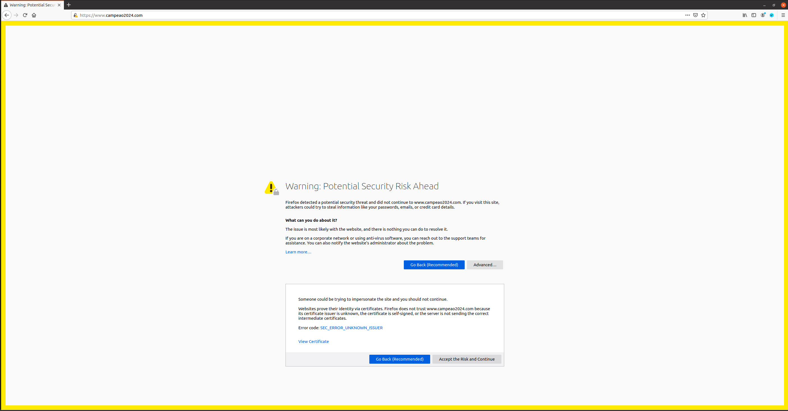
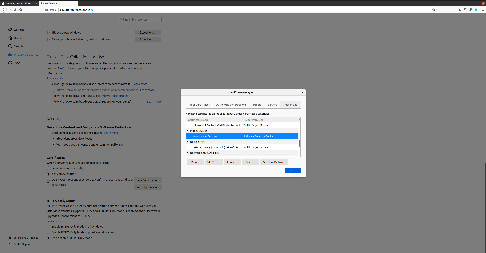
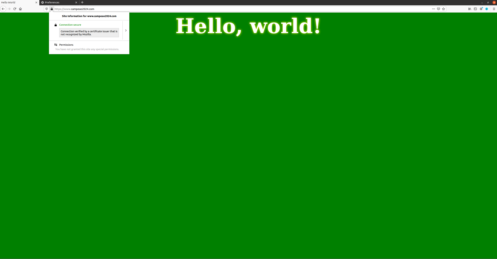
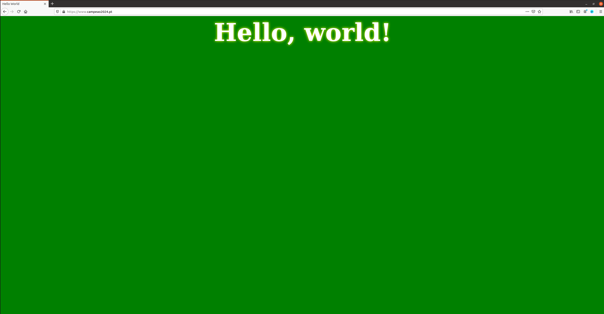
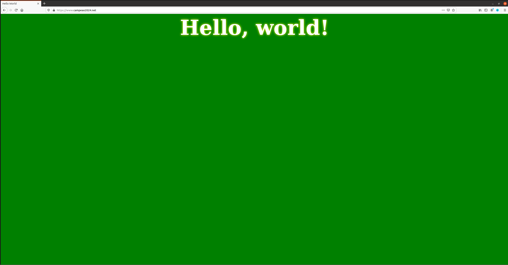
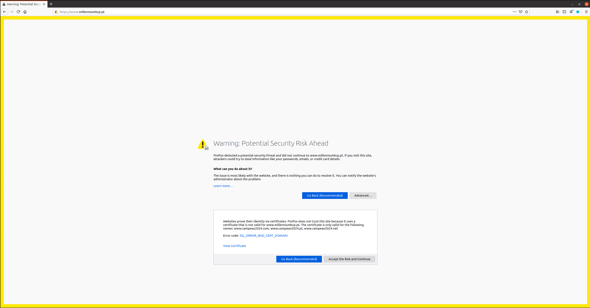
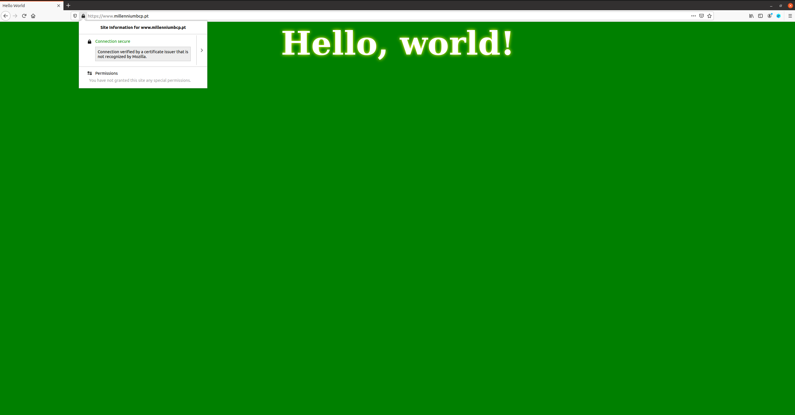

# SEED Labs - Public-Key Infrastructure (PKI) Lab

### DNS setup
Como pedido no guião adicionou-se ao ficheiro etc/hosts as seguintes entradas:

- <pre>10.9.0.80   www.bank32.com </pre>
- <pre>10.9.0.80   www.campeao2024.com </pre>


## Task 1: Becoming a Certificate Authority (CA)

Copiou-se o ficheiro de configuração `openssl.cnf` para o diretório atual, descomentou-se a linha `unique_subject` do mesmo e criou-se os sub-diretórios (`demoCA`, `certs`, `crl` e `newcerts`) e ficheiros (`index.txt` e `serial`) necessários com os seguintes comandos:

```sh
[12/13/24]seed@VM:~/.../Labsetup$ cp /usr/lib/ssl/openssl.cnf .
[12/13/24]seed@VM:~/.../Labsetup$ sudo vi openssl.cnf
[12/13/24]seed@VM:~/.../Labsetup$ mkdir demoCA
[12/13/24]seed@VM:~/.../Labsetup$ cd demoCA
[12/13/24]seed@VM:~/.../demoCA$ mkdir certs crl newcerts
[12/13/24]seed@VM:~/.../demoCA$ touch index.txt serial
[12/13/24]seed@VM:~/.../demoCA$ echo 1000 > serial
```

Gerou-se o certificado _self-signed_, (especificando o `subject` e `password` na linha de comandos) com o comando:

```sh
[12/13/24]seed@VM:~/.../Labsetup$ openssl req -x509 -newkey rsa:4096 -sha256 -days 3650 -keyout ca.key -out ca.crt -subj "/CN=www.modelCA.com/O=Model CA LTD./C=US" -passout pass:dees
Generating a RSA private key
.................................................................................................++++
..................................................................................................................................++++
writing new private key to 'ca.key'
-----
```

Correu-se os comandos `openssl x509 -in ca.crt -text -noout` e `openssl rsa  -in ca.key -text -noout`, cujo _output_ permitiu responder às questões abaixo.

```sh
[12/13/24]seed@VM:~/.../Labsetup$ openssl x509 -in ca.crt -text -noout
Certificate:
    Data:
        Version: 3 (0x2)
        Serial Number:
            66:70:55:4e:9d:e9:2a:86:33:49:d0:2c:2d:ec:f5:04:4a:ef:89:5a
        Signature Algorithm: sha256WithRSAEncryption
        Issuer: CN = www.modelCA.com, O = Model CA LTD., C = US
        Validity
            Not Before: Dec 13 17:37:52 2024 GMT
            Not After : Dec 11 17:37:52 2034 GMT
        Subject: CN = www.modelCA.com, O = Model CA LTD., C = US
        Subject Public Key Info:
            Public Key Algorithm: rsaEncryption
                RSA Public-Key: (4096 bit)
                Modulus:
                    00:e8:6b:56:f5:89:29:c1:66:78:9a:bc:e2:1c:9d:
                    42:f8:28:52:51:ab:8c:d5:15:53:19:06:d7:d0:ee:
                    ae:2d:a0:a4:e4:54:de:53:3f:ec:c7:13:15:51:8a:
                    ab:1e:e1:e4:3b:bc:0a:59:70:4f:79:64:f7:8c:02:
                    5a:d6:5b:5e:b0:6c:30:c0:1e:34:53:b3:08:1b:82:
                    3b:60:85:d9:fb:f7:f8:c1:f1:ac:a1:d9:fd:63:24:
                    71:50:36:35:55:39:94:77:2c:9a:01:30:cc:b3:72:
                    16:f8:80:a2:e8:73:f0:a7:e4:49:ba:be:3f:ad:4b:
                    91:4c:6d:51:f5:2c:5a:b6:10:fd:fe:df:c1:e2:80:
                    35:73:fb:a9:ac:11:61:56:5b:ce:de:fb:69:54:dc:
                    7b:48:a2:49:81:41:99:b9:ff:ab:b7:06:91:fe:9e:
                    8a:c8:ba:fe:5e:7f:1c:8f:ce:25:aa:22:ec:55:be:
                    1b:ac:65:90:12:ee:75:7f:7d:1f:90:ed:7b:74:d2:
                    58:5c:ee:7c:9e:e3:3f:ba:05:8a:a9:2f:41:15:17:
                    1a:5b:13:14:79:23:51:62:c1:95:62:a3:0b:19:57:
                    b4:3c:cc:30:e6:22:aa:71:d3:77:a2:76:5e:d4:4f:
                    4e:bc:ff:a9:42:80:45:11:45:3b:42:52:9b:c2:d7:
                    0f:10:0d:ee:90:28:0c:b2:60:75:37:08:de:79:59:
                    e5:b6:8c:7a:0d:00:59:d2:ed:c8:2a:5c:7c:84:1d:
                    c1:4d:99:68:32:51:21:0b:0d:70:e7:c6:8c:72:b3:
                    05:e8:c5:dc:8c:73:79:4a:c2:91:88:09:05:a5:d2:
                    9d:0a:66:0a:5e:53:fb:e0:5e:62:44:93:69:a8:90:
                    8a:84:be:79:10:61:ee:76:c7:08:18:6a:5b:9a:30:
                    32:31:2c:b6:a0:3a:de:bf:f9:02:4f:52:2e:88:ab:
                    a8:23:fe:5c:da:d4:ed:28:8f:87:ad:2a:8f:83:ff:
                    fe:1c:97:98:ad:b6:b8:4e:9a:ae:3d:d9:fb:c6:09:
                    14:8e:0b:0c:fd:5b:aa:d9:11:b0:38:ef:54:c7:a1:
                    29:c4:f6:a9:6c:05:4c:bb:4e:5a:92:9e:77:12:cc:
                    25:e6:8a:79:5d:98:60:61:4c:f5:aa:8e:49:45:88:
                    d4:fe:7f:73:d5:82:62:bc:00:96:85:47:ca:32:40:
                    f3:63:34:3f:8d:18:1d:2e:d7:6b:2c:0e:50:6d:c7:
                    b4:55:01:f2:d3:8d:5d:6d:ee:b8:8f:d3:1b:bd:53:
                    1d:46:b3:2c:94:a1:52:92:22:8b:46:53:02:ac:c5:
                    8c:40:25:4a:46:01:45:b4:aa:a7:24:a5:59:3e:ee:
                    e8:ea:51
                Exponent: 65537 (0x10001)
        X509v3 extensions:
            X509v3 Subject Key Identifier: 
                7E:AA:39:4A:54:5C:E7:9D:30:10:43:16:0C:06:41:A4:40:86:76:2D
            X509v3 Authority Key Identifier: 
                keyid:7E:AA:39:4A:54:5C:E7:9D:30:10:43:16:0C:06:41:A4:40:86:76:2D

            X509v3 Basic Constraints: critical
                CA:TRUE
    Signature Algorithm: sha256WithRSAEncryption
         9d:04:49:e6:b0:0c:dd:c7:5b:dc:d8:8a:7f:87:b8:92:fa:2c:
         f3:10:60:1d:50:ed:b3:f8:27:e6:c6:d2:8b:71:8a:c9:94:5c:
         7e:70:38:e1:d4:5a:58:86:f5:3f:51:84:74:8d:1d:12:c0:04:
         84:97:03:e4:70:c0:80:5f:0c:06:3d:9d:48:91:00:5e:60:39:
         06:31:77:e2:ad:86:71:f4:f1:6f:d0:f9:2a:c2:9a:56:2d:8e:
         cc:0a:9f:60:db:3e:02:02:38:bf:86:eb:46:4a:ce:e0:79:31:
         85:70:03:de:97:b5:f2:59:ce:8a:23:4e:77:0a:c0:c2:5d:0f:
         90:d6:9c:e9:91:b2:dc:6f:57:0c:ff:da:2b:57:35:cc:c1:0a:
         f2:f6:20:fa:dc:21:3e:36:bf:c1:04:f9:0f:29:f9:3b:05:cd:
         74:f2:56:c5:fb:6b:dc:88:98:24:20:48:57:9a:fe:d2:b8:03:
         2c:43:66:21:d4:72:8f:07:da:2f:50:5d:8f:f6:ca:b4:67:2d:
         b3:8a:40:5f:f1:1c:a3:74:e7:23:ce:3e:72:fe:0f:af:72:a3:
         c8:1b:c2:6d:01:28:f3:1e:87:b9:27:14:02:a4:bc:a3:8e:43:
         22:20:d8:54:4c:9d:60:03:43:a2:de:2b:40:17:09:92:ab:82:
         1c:3b:da:0c:01:ec:3d:0e:9d:f5:13:4f:63:3b:cc:f5:dc:62:
         ad:31:44:1a:d4:f9:2f:ae:95:9f:e7:25:ab:18:42:21:b8:d7:
         ff:1d:a5:b5:88:4c:55:29:ac:73:98:09:80:e5:a3:db:f9:2a:
         7d:e2:81:62:42:bc:b5:c9:de:70:bb:f1:32:95:97:ff:38:72:
         aa:df:e1:67:80:72:6d:da:6c:c0:bf:20:3a:3f:88:09:88:5b:
         60:1a:f6:11:16:91:2d:50:2c:7d:b9:d2:b8:02:62:80:8b:64:
         a7:2b:ce:4c:bf:6d:a0:ec:0f:43:05:94:7f:0c:11:0d:fd:6e:
         de:cc:20:8a:09:72:8a:4b:69:51:b0:1c:f0:b1:9a:af:f2:e8:
         93:64:66:27:88:e1:e9:27:bb:10:69:0f:b7:2e:b8:01:7b:b8:
         ed:43:c8:0d:97:e3:af:46:3a:ba:aa:d9:85:af:88:a7:c3:ff:
         3c:18:48:81:a0:e6:f5:b9:ca:b3:0b:10:a7:e2:ff:37:f1:f2:
         b1:fb:d4:73:ab:22:5d:98:56:dc:f7:4e:ec:92:53:ac:1a:7e:
         c3:00:ea:73:0d:64:0f:8b:07:fb:82:56:65:05:cd:1c:4c:03:
         2b:f4:56:ec:74:bd:ec:b6:dd:7c:3d:16:ba:5c:ed:33:c0:50:
         bb:d7:89:a2:6b:8c:25:db
```

```sh
[12/13/24]seed@VM:~/.../Labsetup$ openssl rsa  -in ca.key -text -noout
Enter pass phrase for ca.key:
RSA Private-Key: (4096 bit, 2 primes)
modulus:
    00:e8:6b:56:f5:89:29:c1:66:78:9a:bc:e2:1c:9d:
    42:f8:28:52:51:ab:8c:d5:15:53:19:06:d7:d0:ee:
    ae:2d:a0:a4:e4:54:de:53:3f:ec:c7:13:15:51:8a:
    ab:1e:e1:e4:3b:bc:0a:59:70:4f:79:64:f7:8c:02:
    5a:d6:5b:5e:b0:6c:30:c0:1e:34:53:b3:08:1b:82:
    3b:60:85:d9:fb:f7:f8:c1:f1:ac:a1:d9:fd:63:24:
    71:50:36:35:55:39:94:77:2c:9a:01:30:cc:b3:72:
    16:f8:80:a2:e8:73:f0:a7:e4:49:ba:be:3f:ad:4b:
    91:4c:6d:51:f5:2c:5a:b6:10:fd:fe:df:c1:e2:80:
    35:73:fb:a9:ac:11:61:56:5b:ce:de:fb:69:54:dc:
    7b:48:a2:49:81:41:99:b9:ff:ab:b7:06:91:fe:9e:
    8a:c8:ba:fe:5e:7f:1c:8f:ce:25:aa:22:ec:55:be:
    1b:ac:65:90:12:ee:75:7f:7d:1f:90:ed:7b:74:d2:
    58:5c:ee:7c:9e:e3:3f:ba:05:8a:a9:2f:41:15:17:
    1a:5b:13:14:79:23:51:62:c1:95:62:a3:0b:19:57:
    b4:3c:cc:30:e6:22:aa:71:d3:77:a2:76:5e:d4:4f:
    4e:bc:ff:a9:42:80:45:11:45:3b:42:52:9b:c2:d7:
    0f:10:0d:ee:90:28:0c:b2:60:75:37:08:de:79:59:
    e5:b6:8c:7a:0d:00:59:d2:ed:c8:2a:5c:7c:84:1d:
    c1:4d:99:68:32:51:21:0b:0d:70:e7:c6:8c:72:b3:
    05:e8:c5:dc:8c:73:79:4a:c2:91:88:09:05:a5:d2:
    9d:0a:66:0a:5e:53:fb:e0:5e:62:44:93:69:a8:90:
    8a:84:be:79:10:61:ee:76:c7:08:18:6a:5b:9a:30:
    32:31:2c:b6:a0:3a:de:bf:f9:02:4f:52:2e:88:ab:
    a8:23:fe:5c:da:d4:ed:28:8f:87:ad:2a:8f:83:ff:
    fe:1c:97:98:ad:b6:b8:4e:9a:ae:3d:d9:fb:c6:09:
    14:8e:0b:0c:fd:5b:aa:d9:11:b0:38:ef:54:c7:a1:
    29:c4:f6:a9:6c:05:4c:bb:4e:5a:92:9e:77:12:cc:
    25:e6:8a:79:5d:98:60:61:4c:f5:aa:8e:49:45:88:
    d4:fe:7f:73:d5:82:62:bc:00:96:85:47:ca:32:40:
    f3:63:34:3f:8d:18:1d:2e:d7:6b:2c:0e:50:6d:c7:
    b4:55:01:f2:d3:8d:5d:6d:ee:b8:8f:d3:1b:bd:53:
    1d:46:b3:2c:94:a1:52:92:22:8b:46:53:02:ac:c5:
    8c:40:25:4a:46:01:45:b4:aa:a7:24:a5:59:3e:ee:
    e8:ea:51
publicExponent: 65537 (0x10001)
privateExponent:
    00:cf:9d:ab:35:74:cc:7e:fd:f9:78:48:88:37:85:
    67:a0:63:ec:7d:16:20:9c:ec:0a:aa:0d:89:d6:12:
    90:37:24:0c:88:07:23:fe:fb:d8:98:50:7c:b7:b5:
    86:7c:f4:ce:bb:69:93:59:27:d1:66:a0:81:dd:68:
    f1:1a:10:ce:ba:0c:3b:54:32:e7:0d:69:9d:31:6d:
    99:7a:f4:b6:af:b5:68:5a:5f:77:95:b1:33:ff:4f:
    3b:85:aa:96:e3:c5:a6:d0:fa:5f:ab:f6:9a:b5:25:
    92:4d:74:23:92:40:97:56:72:c0:45:f7:d2:cc:0b:
    f8:04:6c:97:4c:ca:cd:51:5c:46:78:5a:0b:49:38:
    bc:07:1a:65:0b:d7:0e:bb:65:11:9b:f0:bb:bb:d9:
    a4:ab:52:85:14:d8:b3:e9:09:f1:ab:72:4c:12:46:
    2f:b5:76:0c:e9:fe:e4:55:b5:91:c1:b4:a6:a7:45:
    46:55:2e:f8:8f:60:c2:47:1b:4f:8a:58:09:f3:66:
    3f:16:ec:d7:17:db:ea:3e:52:da:f5:9c:c7:a7:7e:
    56:c5:ca:7a:7c:67:c7:38:cf:b2:91:45:12:12:16:
    5d:63:fe:07:24:5d:0d:22:d7:03:44:76:36:e9:b2:
    da:a4:4c:41:37:ad:7b:85:1c:f1:fd:a1:eb:90:16:
    2a:55:ba:24:7e:48:22:1e:9a:43:c8:ff:6b:4b:e6:
    78:6c:bb:a2:6c:5a:18:e0:76:e2:7c:ae:88:fc:77:
    85:2c:05:d9:02:c2:af:5e:4d:08:c0:38:55:1c:9d:
    d9:4c:90:85:77:1f:b1:77:94:a7:54:39:48:4f:0f:
    c3:33:b3:d9:b2:c5:7a:69:37:3a:8c:2a:fe:bc:30:
    f5:f6:f5:62:38:4b:d3:1a:ff:03:0c:12:5c:81:d9:
    5e:17:85:26:1c:4a:18:6c:e9:96:b9:a9:0e:ab:3b:
    bd:55:06:e3:b6:7a:77:e2:93:ba:27:60:0a:ee:f3:
    21:ee:29:85:1f:0a:7a:9d:cc:46:ac:4e:9d:a3:e4:
    6b:6b:f9:de:36:5e:12:80:e2:bb:b1:8b:74:d6:68:
    67:4f:8e:de:a3:f3:c4:02:15:4a:56:07:32:a3:71:
    2d:a1:f9:ac:ce:f0:fb:4a:6a:26:1d:45:2a:50:d0:
    1e:d8:8d:74:44:33:dd:b9:e2:16:34:40:e0:1a:02:
    1e:b3:e3:7d:36:11:47:20:f3:82:2d:89:4e:c3:3d:
    d2:d0:31:67:48:7b:c2:a6:45:eb:07:56:8f:a4:e7:
    d1:45:9b:9b:28:0a:a3:48:91:2d:9f:61:37:8e:c0:
    99:5c:1f:84:ab:26:fe:02:e1:79:33:07:d9:ed:f8:
    29:57:5d
prime1:
    00:f9:81:66:c8:d9:da:14:4b:d2:0f:24:0e:4a:ba:
    52:83:00:82:00:2f:51:48:2d:5e:34:e5:08:3d:54:
    8e:93:fc:35:be:90:7c:26:bf:91:f5:e6:dc:c0:8a:
    52:89:92:50:a2:f3:d7:a1:cd:20:39:dc:6e:1b:41:
    1a:dd:89:fd:b4:f5:0b:31:26:b3:17:aa:6f:77:df:
    ef:8f:55:df:a1:e7:39:7a:c5:51:37:f8:d3:67:e4:
    5c:3b:ed:9a:00:4a:e3:04:5b:81:f7:08:55:ba:b2:
    10:5a:6e:ec:c8:85:98:49:bc:ea:42:3c:b2:74:63:
    6d:b3:12:71:8a:5c:d1:89:3b:d7:e6:31:5d:ec:8f:
    01:8c:99:bc:8f:8f:95:32:8a:0b:65:59:b0:23:b7:
    ec:bb:db:c2:db:93:db:58:49:c0:da:1c:92:7b:04:
    72:1d:16:54:34:c0:bb:4d:4d:d8:da:e0:8b:b8:98:
    28:92:da:76:21:42:2b:69:d5:64:bb:21:97:75:9f:
    17:f5:6c:3b:f2:41:75:28:8e:64:d6:ee:fc:44:df:
    d4:06:6a:00:ea:2b:c1:8c:a3:a7:5f:0e:f2:fd:26:
    c6:a9:13:a2:77:98:e6:3d:2f:bb:3c:d8:49:b3:db:
    e1:53:f6:5e:cc:3f:78:f2:e3:f7:34:17:20:f7:5b:
    fc:e7
prime2:
    00:ee:78:15:48:dc:3d:df:73:6a:be:0e:10:ac:62:
    a2:f2:f1:f5:54:25:4c:df:38:bb:d6:e5:83:5a:1e:
    57:c8:4a:07:5b:78:74:81:3c:e7:09:82:8c:f7:2c:
    da:10:4a:49:a5:2a:8d:eb:81:98:fa:b2:fd:dc:f2:
    70:43:f3:6b:8d:74:ad:00:1f:94:8e:1d:06:39:51:
    58:a5:12:93:32:2b:cf:76:e3:22:7a:76:08:9b:88:
    f6:47:35:24:27:de:0d:8b:f8:ad:ab:da:69:6a:9e:
    cc:c9:38:e5:7f:ac:fe:dc:03:8d:19:43:5d:6a:47:
    7b:e4:fc:94:5b:a5:9c:90:f8:69:1a:97:59:f4:ca:
    fc:ed:70:f0:58:22:75:6a:42:9d:03:f7:fa:97:d8:
    48:86:18:23:d8:93:45:f9:65:5f:1b:c2:74:4d:15:
    e1:11:cb:43:ec:d3:45:ca:21:26:a1:11:18:0b:e9:
    3d:c0:7f:ea:52:67:74:48:c2:81:ea:42:0c:72:b9:
    30:52:27:2d:59:7c:dc:10:63:bd:e4:2b:15:01:50:
    8d:8a:5a:aa:f6:5e:98:76:59:39:58:1b:85:3e:20:
    2d:0c:2e:11:81:0e:f9:e8:f5:c2:20:de:df:4f:58:
    7f:c4:86:62:83:ac:7d:5f:c5:80:6d:04:4b:5f:d3:
    00:07
exponent1:
    00:92:d7:e8:d1:6e:fd:dd:92:1e:28:11:15:64:3f:
    b2:8e:2d:3f:55:b2:83:89:12:42:6e:a9:19:27:57:
    5b:ae:96:f2:5e:9c:94:a5:0d:7c:6f:18:17:76:2e:
    32:93:8b:0c:70:4b:48:ee:8e:56:58:17:76:aa:0d:
    b0:2d:10:a8:c3:d6:b0:66:96:1b:33:63:78:c5:39:
    83:b9:7d:55:e7:e8:b9:38:9b:66:c8:a5:66:6e:af:
    c4:e4:f4:5a:fd:af:15:5b:1c:2c:2a:62:ba:69:ed:
    a0:98:48:ce:8c:d9:ab:9e:42:54:30:f5:9e:25:c7:
    da:e9:58:82:80:67:4e:5f:11:5c:68:bb:47:47:11:
    87:5c:e3:a2:49:6f:bc:e4:88:c0:5a:3e:e5:de:af:
    c1:e1:72:5e:85:72:c8:d6:76:59:cd:44:a1:a5:4b:
    21:8a:22:f9:1e:2f:0c:4d:5b:f2:b4:27:11:b4:6b:
    c0:fd:65:1b:bf:49:3d:59:c5:60:ca:8d:e3:a1:33:
    28:1b:a6:3e:c5:be:66:a0:9e:e5:94:66:05:0c:d8:
    1a:e6:47:7f:10:52:fe:4f:b2:85:af:f9:91:63:12:
    6e:3b:56:35:f9:63:80:a6:24:30:73:87:ec:20:b1:
    d9:34:dc:3c:40:c3:5e:80:bd:50:61:54:f7:6e:fd:
    b1:a3
exponent2:
    6d:8c:d6:e2:58:e3:47:b2:c2:f7:ba:88:68:59:0b:
    d8:a5:d4:f9:2a:05:8d:8a:87:a8:6a:59:94:5d:da:
    1f:d5:fa:59:48:15:e5:85:2f:f2:0b:7a:6c:d6:ba:
    fa:be:d5:e4:3d:8f:63:00:6f:61:c4:36:a1:78:f2:
    a0:14:c4:75:00:83:b5:49:cc:ba:18:95:52:61:8f:
    62:8e:0c:f7:00:6f:57:83:72:c4:65:53:00:f8:c3:
    82:e4:e3:ce:38:d1:6a:5a:fc:95:b5:49:b6:44:6b:
    79:89:5c:cc:f1:91:47:4b:8e:57:6b:be:0f:63:f5:
    83:b5:91:06:25:27:ae:e5:9f:8b:2a:ba:95:9d:66:
    e2:41:7e:f8:4e:24:38:83:8f:94:52:28:59:f7:6f:
    21:c3:17:3c:98:33:8e:25:c6:b2:7e:fb:64:aa:47:
    72:20:39:fd:22:f5:ad:ac:db:0d:25:48:31:b8:9d:
    b8:c0:4a:ca:3e:62:8a:46:68:de:50:27:5d:d0:bb:
    65:12:40:60:1a:df:11:dc:70:50:d0:85:de:cb:bd:
    aa:30:8a:d7:91:8f:62:d7:0c:63:f0:88:9e:88:b3:
    89:23:e4:c0:b0:3b:98:8c:c5:f8:c9:ca:36:ae:46:
    4b:e7:1c:7c:b7:12:05:9c:3a:aa:5a:4d:b2:20:c1:
    a3
coefficient:
    58:70:ed:86:bb:42:5a:64:56:82:97:9b:27:ec:89:
    f7:c6:01:45:55:4c:6b:3b:8a:bf:ef:57:47:95:fc:
    69:45:02:3c:ce:ad:11:99:37:ce:33:a9:d9:64:8f:
    01:aa:55:d4:22:f0:fd:bf:8b:df:31:05:0c:f8:07:
    45:d8:55:76:c7:05:f4:5e:e0:57:82:81:6c:3c:da:
    1c:de:e2:e9:1e:3f:43:43:bc:dd:e1:c8:10:f1:56:
    cb:65:49:5a:bc:5b:f9:33:7e:3c:cf:ff:3b:95:45:
    71:4b:a3:74:d8:c4:c9:aa:98:39:56:06:d3:ca:52:
    7a:32:63:e3:1f:1f:80:d8:3a:c5:02:23:f2:02:45:
    95:3d:7b:6a:e9:da:09:15:5a:cc:e2:bd:df:f0:a1:
    24:e1:5d:e8:29:7b:4b:cf:f8:a0:31:91:a3:c2:b7:
    57:d0:97:36:af:f7:43:4f:d9:30:4a:1c:66:e4:6e:
    7f:20:00:bc:cf:3c:27:e1:c8:5a:3b:b3:df:cb:16:
    b5:0d:64:02:e3:5a:b9:99:23:94:7e:27:fc:0b:05:
    6c:0c:80:a4:f0:27:5f:a0:66:d7:d4:a4:95:8f:f7:
    54:4e:8b:21:08:86:18:b1:25:67:bb:01:99:ec:21:
    20:ea:3f:79:55:0d:ab:98:3c:c8:f6:54:e2:3c:ae:
    33
```

- What part of the certificate indicates this is a CA’s certificate?

`CA:TRUE` (X509v3 Basic Constraints).

- What part of the certificate indicates this is a self-signed certificate?

Como o `X509v3 Subject Key Identifier` é **igual** ao `X509v3 Authority Key Identifier`, então é um certificado _self-signed_.

- In the RSA algorithm, we have a public exponent e, a private exponent d, a modulus n, and two secret numbers p and q, such that n = pq. Please identify the values for these elements in your certificate and key files.

    - public exponent e: `65537 (0x10001)`

    - private exponent d

    ```
    00:cf:9d:ab:35:74:cc:7e:fd:f9:78:48:88:37:85:
    67:a0:63:ec:7d:16:20:9c:ec:0a:aa:0d:89:d6:12:
    90:37:24:0c:88:07:23:fe:fb:d8:98:50:7c:b7:b5:
    86:7c:f4:ce:bb:69:93:59:27:d1:66:a0:81:dd:68:
    f1:1a:10:ce:ba:0c:3b:54:32:e7:0d:69:9d:31:6d:
    99:7a:f4:b6:af:b5:68:5a:5f:77:95:b1:33:ff:4f:
    3b:85:aa:96:e3:c5:a6:d0:fa:5f:ab:f6:9a:b5:25:
    92:4d:74:23:92:40:97:56:72:c0:45:f7:d2:cc:0b:
    f8:04:6c:97:4c:ca:cd:51:5c:46:78:5a:0b:49:38:
    bc:07:1a:65:0b:d7:0e:bb:65:11:9b:f0:bb:bb:d9:
    a4:ab:52:85:14:d8:b3:e9:09:f1:ab:72:4c:12:46:
    2f:b5:76:0c:e9:fe:e4:55:b5:91:c1:b4:a6:a7:45:
    46:55:2e:f8:8f:60:c2:47:1b:4f:8a:58:09:f3:66:
    3f:16:ec:d7:17:db:ea:3e:52:da:f5:9c:c7:a7:7e:
    56:c5:ca:7a:7c:67:c7:38:cf:b2:91:45:12:12:16:
    5d:63:fe:07:24:5d:0d:22:d7:03:44:76:36:e9:b2:
    da:a4:4c:41:37:ad:7b:85:1c:f1:fd:a1:eb:90:16:
    2a:55:ba:24:7e:48:22:1e:9a:43:c8:ff:6b:4b:e6:
    78:6c:bb:a2:6c:5a:18:e0:76:e2:7c:ae:88:fc:77:
    85:2c:05:d9:02:c2:af:5e:4d:08:c0:38:55:1c:9d:
    d9:4c:90:85:77:1f:b1:77:94:a7:54:39:48:4f:0f:
    c3:33:b3:d9:b2:c5:7a:69:37:3a:8c:2a:fe:bc:30:
    f5:f6:f5:62:38:4b:d3:1a:ff:03:0c:12:5c:81:d9:
    5e:17:85:26:1c:4a:18:6c:e9:96:b9:a9:0e:ab:3b:
    bd:55:06:e3:b6:7a:77:e2:93:ba:27:60:0a:ee:f3:
    21:ee:29:85:1f:0a:7a:9d:cc:46:ac:4e:9d:a3:e4:
    6b:6b:f9:de:36:5e:12:80:e2:bb:b1:8b:74:d6:68:
    67:4f:8e:de:a3:f3:c4:02:15:4a:56:07:32:a3:71:
    2d:a1:f9:ac:ce:f0:fb:4a:6a:26:1d:45:2a:50:d0:
    1e:d8:8d:74:44:33:dd:b9:e2:16:34:40:e0:1a:02:
    1e:b3:e3:7d:36:11:47:20:f3:82:2d:89:4e:c3:3d:
    d2:d0:31:67:48:7b:c2:a6:45:eb:07:56:8f:a4:e7:
    d1:45:9b:9b:28:0a:a3:48:91:2d:9f:61:37:8e:c0:
    99:5c:1f:84:ab:26:fe:02:e1:79:33:07:d9:ed:f8:
    29:57:5d
    ```

    - modulus n

    ```
    00:e8:6b:56:f5:89:29:c1:66:78:9a:bc:e2:1c:9d:
    42:f8:28:52:51:ab:8c:d5:15:53:19:06:d7:d0:ee:
    ae:2d:a0:a4:e4:54:de:53:3f:ec:c7:13:15:51:8a:
    ab:1e:e1:e4:3b:bc:0a:59:70:4f:79:64:f7:8c:02:
    5a:d6:5b:5e:b0:6c:30:c0:1e:34:53:b3:08:1b:82:
    3b:60:85:d9:fb:f7:f8:c1:f1:ac:a1:d9:fd:63:24:
    71:50:36:35:55:39:94:77:2c:9a:01:30:cc:b3:72:
    16:f8:80:a2:e8:73:f0:a7:e4:49:ba:be:3f:ad:4b:
    91:4c:6d:51:f5:2c:5a:b6:10:fd:fe:df:c1:e2:80:
    35:73:fb:a9:ac:11:61:56:5b:ce:de:fb:69:54:dc:
    7b:48:a2:49:81:41:99:b9:ff:ab:b7:06:91:fe:9e:
    8a:c8:ba:fe:5e:7f:1c:8f:ce:25:aa:22:ec:55:be:
    1b:ac:65:90:12:ee:75:7f:7d:1f:90:ed:7b:74:d2:
    58:5c:ee:7c:9e:e3:3f:ba:05:8a:a9:2f:41:15:17:
    1a:5b:13:14:79:23:51:62:c1:95:62:a3:0b:19:57:
    b4:3c:cc:30:e6:22:aa:71:d3:77:a2:76:5e:d4:4f:
    4e:bc:ff:a9:42:80:45:11:45:3b:42:52:9b:c2:d7:
    0f:10:0d:ee:90:28:0c:b2:60:75:37:08:de:79:59:
    e5:b6:8c:7a:0d:00:59:d2:ed:c8:2a:5c:7c:84:1d:
    c1:4d:99:68:32:51:21:0b:0d:70:e7:c6:8c:72:b3:
    05:e8:c5:dc:8c:73:79:4a:c2:91:88:09:05:a5:d2:
    9d:0a:66:0a:5e:53:fb:e0:5e:62:44:93:69:a8:90:
    8a:84:be:79:10:61:ee:76:c7:08:18:6a:5b:9a:30:
    32:31:2c:b6:a0:3a:de:bf:f9:02:4f:52:2e:88:ab:
    a8:23:fe:5c:da:d4:ed:28:8f:87:ad:2a:8f:83:ff:
    fe:1c:97:98:ad:b6:b8:4e:9a:ae:3d:d9:fb:c6:09:
    14:8e:0b:0c:fd:5b:aa:d9:11:b0:38:ef:54:c7:a1:
    29:c4:f6:a9:6c:05:4c:bb:4e:5a:92:9e:77:12:cc:
    25:e6:8a:79:5d:98:60:61:4c:f5:aa:8e:49:45:88:
    d4:fe:7f:73:d5:82:62:bc:00:96:85:47:ca:32:40:
    f3:63:34:3f:8d:18:1d:2e:d7:6b:2c:0e:50:6d:c7:
    b4:55:01:f2:d3:8d:5d:6d:ee:b8:8f:d3:1b:bd:53:
    1d:46:b3:2c:94:a1:52:92:22:8b:46:53:02:ac:c5:
    8c:40:25:4a:46:01:45:b4:aa:a7:24:a5:59:3e:ee:
    e8:ea:51
    ```

    - secret number p

    ```
    prime1:
    00:f9:81:66:c8:d9:da:14:4b:d2:0f:24:0e:4a:ba:
    52:83:00:82:00:2f:51:48:2d:5e:34:e5:08:3d:54:
    8e:93:fc:35:be:90:7c:26:bf:91:f5:e6:dc:c0:8a:
    52:89:92:50:a2:f3:d7:a1:cd:20:39:dc:6e:1b:41:
    1a:dd:89:fd:b4:f5:0b:31:26:b3:17:aa:6f:77:df:
    ef:8f:55:df:a1:e7:39:7a:c5:51:37:f8:d3:67:e4:
    5c:3b:ed:9a:00:4a:e3:04:5b:81:f7:08:55:ba:b2:
    10:5a:6e:ec:c8:85:98:49:bc:ea:42:3c:b2:74:63:
    6d:b3:12:71:8a:5c:d1:89:3b:d7:e6:31:5d:ec:8f:
    01:8c:99:bc:8f:8f:95:32:8a:0b:65:59:b0:23:b7:
    ec:bb:db:c2:db:93:db:58:49:c0:da:1c:92:7b:04:
    72:1d:16:54:34:c0:bb:4d:4d:d8:da:e0:8b:b8:98:
    28:92:da:76:21:42:2b:69:d5:64:bb:21:97:75:9f:
    17:f5:6c:3b:f2:41:75:28:8e:64:d6:ee:fc:44:df:
    d4:06:6a:00:ea:2b:c1:8c:a3:a7:5f:0e:f2:fd:26:
    c6:a9:13:a2:77:98:e6:3d:2f:bb:3c:d8:49:b3:db:
    e1:53:f6:5e:cc:3f:78:f2:e3:f7:34:17:20:f7:5b:
    fc:e7
    ```

    - secret number q

    ```
    prime2:
    00:ee:78:15:48:dc:3d:df:73:6a:be:0e:10:ac:62:
    a2:f2:f1:f5:54:25:4c:df:38:bb:d6:e5:83:5a:1e:
    57:c8:4a:07:5b:78:74:81:3c:e7:09:82:8c:f7:2c:
    da:10:4a:49:a5:2a:8d:eb:81:98:fa:b2:fd:dc:f2:
    70:43:f3:6b:8d:74:ad:00:1f:94:8e:1d:06:39:51:
    58:a5:12:93:32:2b:cf:76:e3:22:7a:76:08:9b:88:
    f6:47:35:24:27:de:0d:8b:f8:ad:ab:da:69:6a:9e:
    cc:c9:38:e5:7f:ac:fe:dc:03:8d:19:43:5d:6a:47:
    7b:e4:fc:94:5b:a5:9c:90:f8:69:1a:97:59:f4:ca:
    fc:ed:70:f0:58:22:75:6a:42:9d:03:f7:fa:97:d8:
    48:86:18:23:d8:93:45:f9:65:5f:1b:c2:74:4d:15:
    e1:11:cb:43:ec:d3:45:ca:21:26:a1:11:18:0b:e9:
    3d:c0:7f:ea:52:67:74:48:c2:81:ea:42:0c:72:b9:
    30:52:27:2d:59:7c:dc:10:63:bd:e4:2b:15:01:50:
    8d:8a:5a:aa:f6:5e:98:76:59:39:58:1b:85:3e:20:
    2d:0c:2e:11:81:0e:f9:e8:f5:c2:20:de:df:4f:58:
    7f:c4:86:62:83:ac:7d:5f:c5:80:6d:04:4b:5f:d3:
    00:07
    ```


## Task 2: Generating a Certificate Request for Your Web Server

Gerou-se o CSR para `www.campeao2024.com` com dois nomes alternativos (`www.campeao2024.pt` e `www.campeao2024.net`) com o seguinte comando:

```sh
[12/13/24]seed@VM:~/.../Labsetup$ openssl req -newkey rsa:2048 -sha256 \
> -keyout server.key -out server.csr \
> -subj "/CN=www.campeao2024.com/O=Campeao2024 Inc./C=US" \
> -passout pass:dees \
> -addext "subjectAltName = DNS:www.campeao2024.com,  \
> DNS:www.campeao2024.pt, \
> DNS:www.campeao2024.net"
Generating a RSA private key
..+++++
......................................................................................+++++
writing new private key to 'server.key'
-----
```

Com o comando `openssl req -in server.csr -text -noout` é possível verificar o conteúdo do ficheiro CSR - `server.csr`.

```sh
[12/13/24]seed@VM:~/.../Labsetup$ openssl req -in server.csr -text -noout
Certificate Request:
    Data:
        Version: 1 (0x0)
        Subject: CN = www.campeao2024.com, O = Campeao2024 Inc., C = US
        Subject Public Key Info:
            Public Key Algorithm: rsaEncryption
                RSA Public-Key: (2048 bit)
                Modulus:
                    00:ba:00:56:c6:16:60:69:de:c0:b8:be:2a:a5:e2:
                    6f:15:c4:05:0a:f8:b1:b5:c9:f0:69:82:aa:2c:f2:
                    [...]
                Exponent: 65537 (0x10001)
        Attributes:
        Requested Extensions:
            X509v3 Subject Alternative Name: 
                DNS:www.campeao2024.com, DNS:www.campeao2024.pt, DNS:www.campeao2024.net
    Signature Algorithm: sha256WithRSAEncryption
         8a:21:92:45:bc:0a:d9:ca:75:43:fe:76:18:cd:29:25:5d:f1:
         63:0a:ab:0b:70:08:cf:f2:63:e3:ec:a5:16:1f:76:75:2a:bd:
         [...]
```

## Task 3: Generating a Certificate for your server

Depois de descomentar a linha `copy_extensions = copy` no ficheiro de configuração `openssl.cnf`, foi possível transformar o CSR (`server.csr`) num certificado X509 (`server.crt`) usando o seguinte comando:

```sh
[12/13/24]seed@VM:~/.../Labsetup$ openssl ca -config openssl.cnf -policy policy_anything \
> -md sha256 -days 3650 \
> -in server.csr -out server.crt -batch \
> -cert ca.crt -keyfile ca.key
Using configuration from openssl.cnf
Enter pass phrase for ca.key:
Check that the request matches the signature
Signature ok
Certificate Details:
        Serial Number: 4096 (0x1000)
        Validity
            Not Before: Dec 13 18:38:45 2024 GMT
            Not After : Dec 11 18:38:45 2034 GMT
        Subject:
            countryName               = US
            organizationName          = Campeao2024 Inc.
            commonName                = www.campeao2024.com
        X509v3 extensions:
            X509v3 Basic Constraints: 
                CA:FALSE
            Netscape Comment: 
                OpenSSL Generated Certificate
            X509v3 Subject Key Identifier: 
                AA:06:04:0A:47:CF:C1:5D:70:30:8D:64:50:36:7D:61:CD:FB:72:AB
            X509v3 Authority Key Identifier: 
                keyid:7E:AA:39:4A:54:5C:E7:9D:30:10:43:16:0C:06:41:A4:40:86:76:2D

            X509v3 Subject Alternative Name: 
                DNS:www.campeao2024.com, DNS:www.campeao2024.pt, DNS:www.campeao2024.net
Certificate is to be certified until Dec 11 18:38:45 2034 GMT (3650 days)

Write out database with 1 new entries
Data Base Updated
```

Tal como é sugerido, com o comando `openssl x509 -in server.crt -text -noout` verificou-se em `X509v3 Subject Alternative Name` que os nomes alternativos (`www.campeao2024.com`, `www.campeao2024.pt` e `www.campeao2024.net`) estão incluídos no certificado. 

```sh
[12/13/24]seed@VM:~/.../Labsetup$ openssl x509 -in server.crt -text -noout
Certificate:
    Data:
        Version: 3 (0x2)
        Serial Number: 4096 (0x1000)
        Signature Algorithm: sha256WithRSAEncryption
        Issuer: CN = www.modelCA.com, O = Model CA LTD., C = US
        Validity
            Not Before: Dec 13 18:38:45 2024 GMT
            Not After : Dec 11 18:38:45 2034 GMT
        Subject: C = US, O = Campeao2024 Inc., CN = www.campeao2024.com
        Subject Public Key Info:
            Public Key Algorithm: rsaEncryption
                RSA Public-Key: (2048 bit)
                Modulus:
                    00:ba:00:56:c6:16:60:69:de:c0:b8:be:2a:a5:e2:
                    6f:15:c4:05:0a:f8:b1:b5:c9:f0:69:82:aa:2c:f2:
                    a4:dc:b8:dc:60:d2:7b:0b:2e:27:80:0d:39:e2:c3:
                    05:3e:8c:a3:17:18:30:e1:a6:5a:6b:3d:ca:be:7d:
                    a1:31:b3:74:c0:d0:ab:b0:6d:f4:e9:21:ac:f8:ba:
                    c9:eb:cf:64:4a:d5:af:25:fc:7e:31:e7:16:53:e1:
                    e8:87:cc:c1:c8:27:ec:7f:09:e8:3b:c6:90:3a:f5:
                    bc:d5:1c:20:5a:f8:3b:f8:2b:46:01:99:9d:87:97:
                    54:1c:4c:ff:31:ae:06:c5:25:32:6a:98:14:7a:b1:
                    0e:72:d5:58:af:a2:c2:91:46:3b:c4:97:68:22:01:
                    32:9d:56:2b:67:9b:43:7d:b1:21:e4:4d:95:e0:9f:
                    7a:e2:3f:72:21:13:1f:99:8b:68:7d:ca:fe:52:c0:
                    cc:bb:2e:ac:7f:85:51:58:29:e2:19:98:b0:e2:0f:
                    ec:c2:a3:7e:c0:c4:c7:88:af:07:0b:0b:84:ee:5e:
                    5e:1d:d9:7b:13:f1:c5:2d:10:8f:54:21:e9:54:bd:
                    e2:19:ef:96:74:06:d3:d1:82:b2:27:b7:9c:bc:9b:
                    ea:73:04:63:a9:3a:82:38:1a:92:dd:45:45:6b:2c:
                    a1:41
                Exponent: 65537 (0x10001)
        X509v3 extensions:
            X509v3 Basic Constraints: 
                CA:FALSE
            Netscape Comment: 
                OpenSSL Generated Certificate
            X509v3 Subject Key Identifier: 
                AA:06:04:0A:47:CF:C1:5D:70:30:8D:64:50:36:7D:61:CD:FB:72:AB
            X509v3 Authority Key Identifier: 
                keyid:7E:AA:39:4A:54:5C:E7:9D:30:10:43:16:0C:06:41:A4:40:86:76:2D

            X509v3 Subject Alternative Name: 
                DNS:www.campeao2024.com, DNS:www.campeao2024.pt, DNS:www.campeao2024.net
    Signature Algorithm: sha256WithRSAEncryption
         d2:11:84:55:ac:d7:2f:a0:51:c8:c0:d3:ac:4c:33:da:3e:6d:
         bf:78:14:56:01:19:61:a8:c9:d3:d9:b7:90:64:fc:50:7b:88:
         [...]
```

## Task 4: Deploying Certificate in an Apache-Based HTTPS Website

Seguiu-se o exemplo fornecido para fazer as alterações necessárias no `Dockerfile` e criar o ficheiro `campeao2024_apache_ssl.conf` (baseado no `bank32_apache_ssl.conf`), cuja explicação já se encontra no guião, daí ser aqui omitida. Os campos `DocumentRoot`, `ServerName`, `ServerAlias`, `SSLCertificateFile` e `SSLCertificateKeyFile` (do ficheiro `bank32_apache_ssl.conf`) foram modificados, para além dos ficheiros `server.crt` e `server.key` terem sido copiados para a pasta `image_www/certs`.

- campeao2024_apache_ssl.conf 

```conf
<VirtualHost *:443>
    DocumentRoot /var/www/campeao2024
    ServerName www.campeao2024.com
    ServerAlias www.campeao2024.pt
    ServerAlias www.campeao2024.net
    DirectoryIndex index.html
    SSLEngine On
    SSLCertificateFile /certs/server.crt
    SSLCertificateKeyFile /certs/server.key
</VirtualHost>

<VirtualHost *:80>
    DocumentRoot /var/www/campeao2024
    ServerName www.campeao2024.com
    DirectoryIndex index_red.html
</VirtualHost>

# Set the following gloal entry to suppress an annoying warning message
ServerName localhost
```

- Dockerfile

```dockerfile
FROM handsonsecurity/seed-server:apache-php
  
ARG WWWDIR=/var/www/campeao2024

COPY ./index.html ./index_red.html $WWWDIR/
COPY ./campeao2024_apache_ssl.conf /etc/apache2/sites-available
COPY ./certs/server.crt ./certs/server.key  /certs/

RUN  chmod 400 /certs/server.key \
     && chmod 644 $WWWDIR/index.html \
     && chmod 644 $WWWDIR/index_red.html \
     && a2ensite campeao2024_apache_ssl

CMD  tail -f /dev/null
```

Para iniciar o servidor Apache utilizou-se o comando `service apache2 start`.

```sh
[12/13/24]seed@VM:~/.../Labsetup$ dockps
30268f138bef  www-10.9.0.80
[12/13/24]seed@VM:~/.../Labsetup$ docksh 30
root@30268f138bef:/# service apache2 start
 * Starting Apache httpd web server apache2                                                                                                                                                                           Enter passphrase for SSL/TLS keys for www.campeao2024.com:443 (RSA):
 * 
```

Ao tentar aceder a `https://www.campeao2024.com`, usando o _browser_ Firefox, é possível visualizar a mensagem de aviso `"Warning: Potential Security Risk Ahead"` cujo código de erro é `SEC_ERROR_UNKNOWN_ISSUER`.



Isto acontece, porque o _browser_ (Firefox) não conhece o emissor do certificado usado por `www.campeao2024.com`, neste caso `Model CA LTD.` (task 1). Isto é, `Model CA LTD.` não está na lista de CAs confiáveis do _browser_, logo nenhum certificado emitido por esse CA será de confiança. No entanto, é possível adicionar manualmente `Model CA LTD.` - ficheiro `ca.crt`- à lista, tal como é explicado no guião e no seguinte _screenshot_.



Assim, é possível aceder a `https://www.campeao2024.com` e aos nomes alternativos (`https://www.campeao2024.pt` e `https://www.campeao2024.net`) sem ser apresentada qualquer mensagem de aviso, como se pode confirmar nos _screenshots_ abaixo.







## Task 5: Launching a Man-In-The-Middle Attack

O _website_ escolhido foi o `www.millenniumbcp.pt` e modificou-se o campo `ServerName` do ficheiro `campeao2024_apache_ssl.conf`, utilizado na `task 4`, como é sugerido:

- campeao2024_apache_ssl.conf 

```conf
<VirtualHost *:443>
    DocumentRoot /var/www/campeao2024
    ServerName www.millenniumbcp.pt
    ServerAlias www.campeao2024.pt
    ServerAlias www.campeao2024.net
    DirectoryIndex index.html
    SSLEngine On
    SSLCertificateFile /certs/server.crt
    SSLCertificateKeyFile /certs/server.key
</VirtualHost>

<VirtualHost *:80>
    DocumentRoot /var/www/campeao2024
    ServerName www.millenniumbcp.pt
    DirectoryIndex index_red.html
</VirtualHost>

# Set the following gloal entry to suppress an annoying warning message
ServerName localhost
```

Para mapear o _hostname_ `www.millenniumbcp.pt` para o nosso servidor malicioso foi acrescentada a linha abaixo no ficheiro `/etc/hosts`, assim é possível simular o resultado de um _DNS cache positing attack_.

```
10.9.0.80  www.millenniumbcp.pt
```

Ao tentar aceder a `https://www.millenniumbcp.pt`, usando o _browser_ Firefox, é possível visualizar a mensagem de aviso `"Warning: Potential Security Risk Ahead"` cujo código de erro é `SSL ERROR BAD CERT DOMAIN`. Isto aconte, porque o certificado utilizado (emitido por `Model CA LTD.`) não tem `www.millenniumbcp.pt` como nome alternativo, logo o _browser_ não confia no site.



## Task 6: Launching a Man-In-The-Middle Attack with a Compromised CA

Com o acesso à `private key` - ficheiro `ca.key` -  do CA criado na `task 1` é possível gerar qualquer certificado. Para isso, gerou-se primeiro o **CSR** para `www.millenniumbcp.pt` (sem nomes alternativos) com o seguinte comando:

```sh
[12/13/24]seed@VM:~/.../Labsetup$ openssl req -newkey rsa:2048 -sha256 \
> -keyout server.key -out server.csr \
> -subj "/CN=www.millenniumbcp.pt/O=Millenniumbcp/C=US" \
> -passout pass:dees 
Generating a RSA private key
.....+++++
..................+++++
writing new private key to 'server.key'
-----
```

Em seguida, foi possível transformar o CSR (server.csr) num **certificado X509** (server.crt) usando o seguinte comando (com a `private key`):

```sh
[12/13/24]seed@VM:~/.../Labsetup$ openssl ca -config openssl.cnf -policy policy_anything \
> -md sha256 -days 3650 \
> -in server.csr -out server.crt -batch \
> -cert ca.crt -keyfile ca.key
Using configuration from openssl.cnf
Enter pass phrase for ca.key:
Check that the request matches the signature
Signature ok
Certificate Details:
        Serial Number: 4097 (0x1001)
        Validity
            Not Before: Dec 13 20:44:18 2024 GMT
            Not After : Dec 11 20:44:18 2034 GMT
        Subject:
            countryName               = US
            organizationName          = Millenniumbcp
            commonName                = www.millenniumbcp.pt
        X509v3 extensions:
            X509v3 Basic Constraints: 
                CA:FALSE
            Netscape Comment: 
                OpenSSL Generated Certificate
            X509v3 Subject Key Identifier: 
                E1:8E:99:01:D6:97:2A:D9:82:07:28:4A:8F:D8:28:72:6F:D7:68:11
            X509v3 Authority Key Identifier: 
                keyid:7E:AA:39:4A:54:5C:E7:9D:30:10:43:16:0C:06:41:A4:40:86:76:2D

Certificate is to be certified until Dec 11 20:44:18 2034 GMT (3650 days)

Write out database with 1 new entries
Data Base Updated
```

Os ficheiros `server.crt` e `server.key` foram copiados para a pasta `image_www/certs` (substituindo os anteriores) e usou-se a mesma configuração da `task 5`, isto é, não foram feitas alterações nos ficheiros `campeao2024_apache_ssl.conf` (e `Dockerfile`) nem ao `/etc/hosts`. Finalmente, reiniciou-se o _container_ e iniciou-se o servidor Apache com o comando `service apache2 start`, como já foi mostrado na `task 4`. Acedendo ao _fake_  `https://www.millenniumbcp.pt` não se verifica qualquer mensagem de aviso como demonstra o _screenshot_ abaixo.



# Questão 2 (Moodle)

**Uma** opção é usar `Certificate Revocation Lists` (CRLs), que nada mais é que uma lista com todos os certificados que já não podem ser confiados. Porém existem várias medidas que os atacantes podem tomar para neutralizar esta proteção como: usar certificados revogados antes da atualização da lista, causar um DoS ao serviço que distribui a lista impedindo assim que a sua versão mais atualizada seja entregue aos sistemas que a requisitarem ou usar certificados comprometidos em ambientes onde não há verificação em tempo real (redes isoladas ou ataques MITM onde a lista não é consultada).

