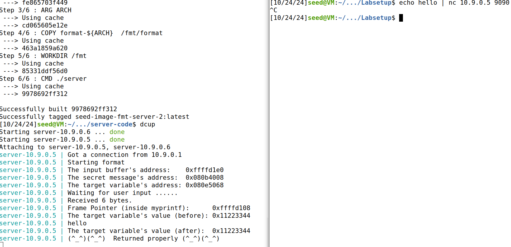
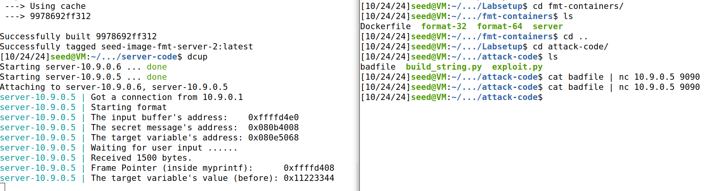
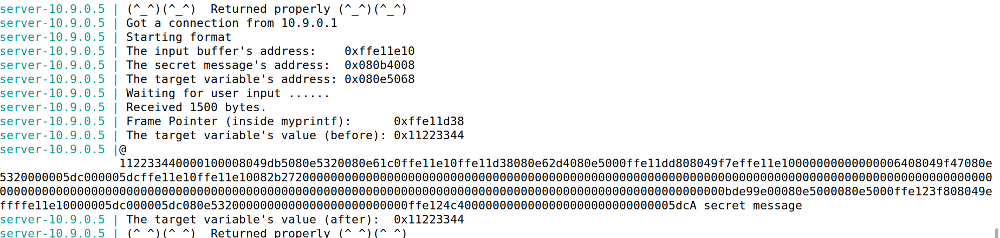
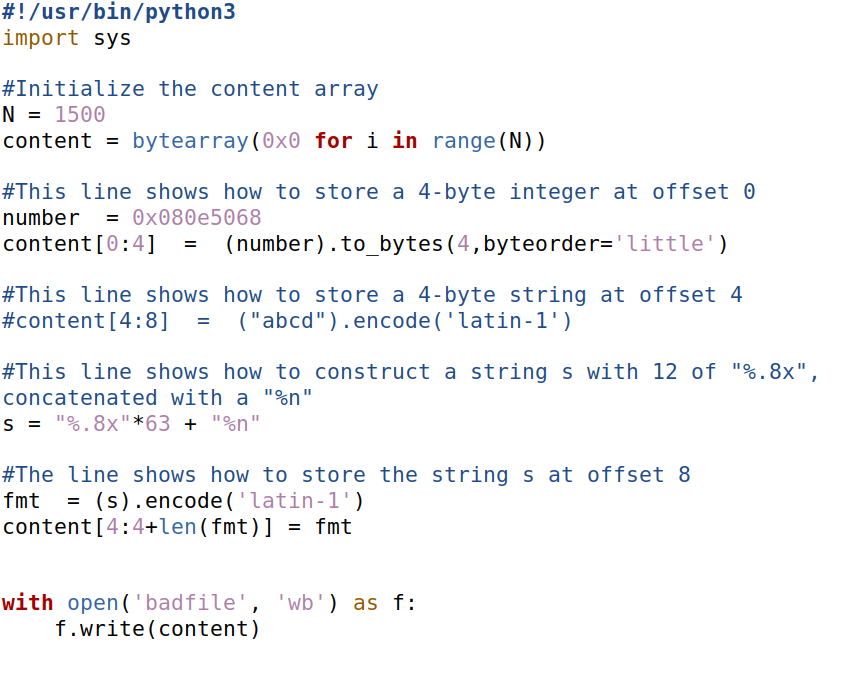
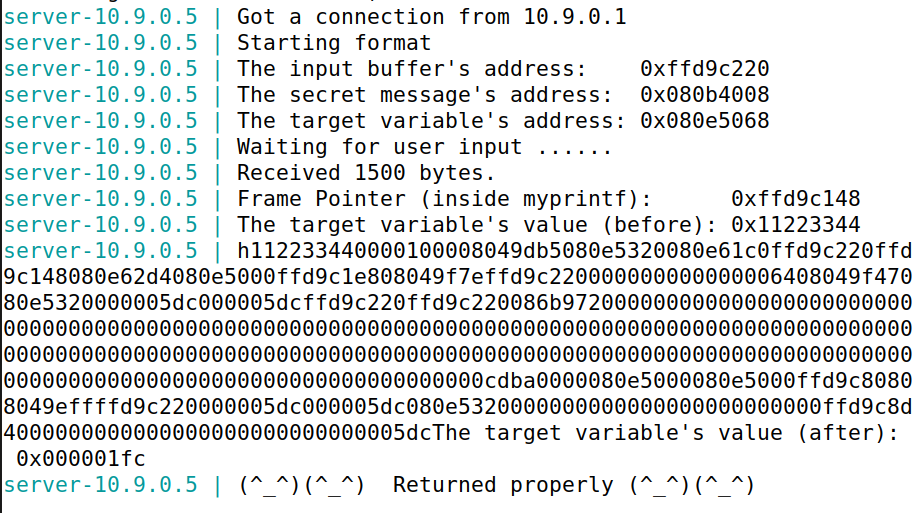
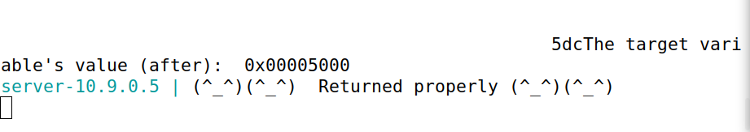

# SEED LABS - Format-String Vulnerability Lab

## Task 1: Crashing the Program

Na pasta server-code usamos make para compilar. Depois, executamos os containers com dcbuild e dcup. Para interagir com o servidor, usamos outro terminal e executamos o seguinte comando:

```bash
$ echo hello | nc 10.9.0.5 909
```
E o resultado foi o seguinte:



Uma vez que, a função printf é chamada (na myprintf) sem nenhum argumento opcional, caso o input (string) sejam vários format specifiers, o seu pointer va_list irá avançar para endereços além da sua stack frame. Assim, o payload guardado em build_string.py, foi preenchido com vários %s.
Para cada format specifier %s, a função printf irá tratar o valor obtido (para onde va_list aponta) como um endereço e tenta imprimir o valor desse mesmo endereço. O programa irá terminar indevidamente quando a função printf tentar imprimir o valor de um endereço inválido (null pointers, endereços que apontam para memória protegida ou endereços virtuais que não estão mapeados na memória física). Deste modo, o número de %s a utilizar como input para obter o resultado pretendido (crashing the program) é variável (no caso optou-se por preencher os 1500 bytes).

Depois de correr o seguinte comando:
```bash
cat badfile | nc 10.9.0.5 9090
```

O resultado foi o seguinte:



Não é imprimida nenhuma mensagem de retorno, pelo que presupomos que o programa terminou sem retornar devidamente.

## Task 2: Printing Out the Server Program’s Memory
### Task 2.A: Stack Data

Foram necessários 64 format specifiers %x para 0x41414141 ser impresso. 0x41414141 (4 bytes) foi colocado no início do input e o valor, 64, foi obtido por tentativa e erro.

- build_string.py
```python
#!/usr/bin/python3
import sys

# Initialize the content array
N = 1500
content = bytearray(0x0 for i in range(N))

number  = 0x41414141
content[0:4]  =  (number).to_bytes(4,byteorder='little')

s = "%.8x\n"*64

fmt  = (s).encode('latin-1')
content[4:4+len(fmt)] = fmt

# Write the content to badfile
with open('badfile', 'wb') as f:
  f.write(content)
```

- Printout do container:
```
server-10.9.0.5 | Got a connection from 10.9.0.1
server-10.9.0.5 | Starting format
server-10.9.0.5 | The input buffer's address:    0xffffd810
server-10.9.0.5 | The secret message's address:  0x080b4008
server-10.9.0.5 | The target variable's address: 0x080e5068
server-10.9.0.5 | Waiting for user input ......
server-10.9.0.5 | Received 1500 bytes.
server-10.9.0.5 | Frame Pointer (inside myprintf):      0xffffd738
server-10.9.0.5 | The target variable's value (before): 0x11223344
server-10.9.0.5 | AAAA11223344
server-10.9.0.5 | 00001000
server-10.9.0.5 | 08049db5
(60 linhas ocultas)
server-10.9.0.5 | 41414141
server-10.9.0.5 | The target variable's value (after):  0x11223344
server-10.9.0.5 | (^_^)(^_^)  Returned properly (^_^)(^_^)
```

### Task 2.B: Printing Out the Server Program’s Memory

A mensagem secreta foi armazenada na heap, o que exige que saibamos o endereço exato dela para conseguirmos lê-la usando a vulnerabilidade de format string. O servidor já nos fornece o endereço da mensagem, o que facilita esse processo.


Em relação à alínea anterior, os primeiros 4 bytes do input (variável `number`) foram substituídos pelo endereço da _secret message_, `0x080b4008`, que foi obtido através do printout do server - `"The secret message's address:  0x080b4008`. O último format specifier `%x` foi substituído por `%s`, assim a função `printf` trata o valor desse endereço como uma `string`. O output obtido foi o seguinte:



A sequência %.8x * 63 garante que o programa percorra a pilha até o ponto em que a mensagem secreta está acessível. Como a mensagem foi alocada na heap, é necessário fornecer o endereço exato e alinhar o offset corretamente na pilha para que %s leia o conteúdo da heap. O fato de a mensagem secreta ter sido exibida indica que o programa conseguiu acessar e exibir o valor desejado na memória.


## Task 3: Modifying the Server Program’s Memory
### Task 3.A: Change the value to a different value

O endereço da variável `target` é `0x080e5068` e este corresponde aos primeiros 4 bytes do input, à semelhança do que foi feito na Task 2. Por último, foi utilizado o format specifier `%n`. Deste modo o número de caracteres impressos pela função `printf` será guardado no endereço indicado, o que permite alterar o valor da variável para outro qualquer. Através do printout do container é possível confirmar que o valor original da variável `target` (0x11223344) foi alerado para `0x1fc`, que corresponde a 508 em decimal. Isto quer dizer que 508 caracteres foram impressos antes da função `printf` tratar o último format specifier.



Depois de excutar o comando "python3 build_string.py", e depois enviar para o servidor o ficheiro badfile, o output obtido foi o seguinte:




Como podemos ver, a variavel foi alterada com sucesso. 


### Task 3.B: Change the value to 0x5000

De forma a alterar a variável `target` para um valor específico, neste caso `0x5000` (20480 em decimal), com a técnica da task anterior é necessário utilizar `precision modifiers` ou `width modifiers` para controlar o número de dígitos impressos e consequentemente o valor final da variável.  

Criou-se uma variável "desired_value" com o valor 20480 e usamos o "f("%{desired_value - (62 * 8) - 4}x" + "%n")" ou o f"%{desired_value - (61 * 8) - 12}x" para modificar a variavel com o valor que queremos.


O output obtido foi o seguinte:



Como podemos ver, a variavel foi alterada com sucesso para 0x5000. 


## Questão 2 (Moodle)

A presença de uma format string na stack facilita alguns tipos de ataque, mas **não** é estritamente necessário que a format string esteja na stack para que a vulnerabilidade exista.  
Quando a format string está na stack, o atacante pode abusar da stack diretamente, isto é facilita ataques como stack smashing ou leitura de valores armazenados na stack e é possível manipular diretamente o fluxo de execução.  
No entanto, mesmo quando a format string está noutras áreas da memória como na heap, pode permitir leitura/escrita de variáveis locais ou modificar valores alocados dinamicamente. Alguns tipos específicos de ataques podem ser mitigados ou mais difíceis de explorar devido ao comportamento de alocação de memória e acesso na heap em comparação com a stack (a heap está separada da stack na memória), isto é, pode dificultar ataques que dependem de aceder ou modificar diretamente elementos na stack, tal como o return pointer e variáveis locais.  
Por exemplo, a técnica usada no guião de dar o input (string) com vários format specifiers e assim fazer movimentar o pointer va_list e imprimir dados da stack já não seria possível se a format string estivesse ser alocada na heap.